## Ausgangslage – Konventionelle Anzeige

  

    <figure>
      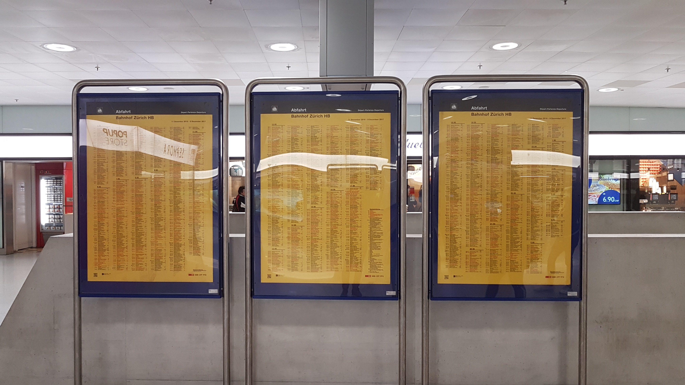
    	<figcaption>Abfahrtszeiten als Plakate</figcaption>
    </figure>
  

  

    <figure>
      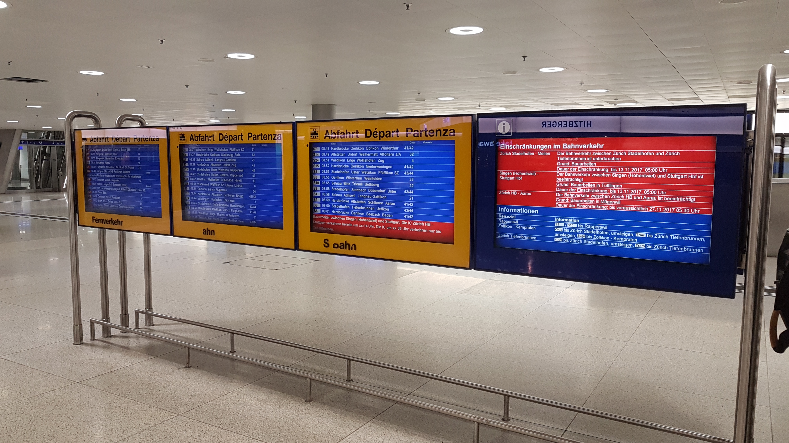
      <figcaption>Abfahrtszeiten als Screen ohne Interaktion</figcaption>
    </figure>
  

Bis anhin wurden die Abfahrtszeiten an mehreren Orten innerhalb des Hauptbahnhof angezeigt. Nicht nur auf den Gleisen und in Gleisnähe dienen die gelb markierten Plakate oder Screens zur Orientierung, sondern es gibt auch an vielen Stellen im Hauptbahnhof diese Information zum ansehen ohne dass eine Interaktion über Berührung getätigt werden muss. Die Reisenden informieren sich und können dann auf ihr jeweiliges Gleis – dem Orientierungssystem folgend – gehen. Die Gestaltung ist klar und funktional und dem Lesenden dienend.

## Ausgangslage – Neues Panel

  <figure>
  	
  	<figcaption>Fahrplanauskunft als Hauptfunktion des neuen Panels</figcaption>
  </figure>

Seit Herbst 2017 steht im stark frequentierten Hauptbahnhof Zürich im Bereich des S-Bahnhofes ein Panel, welches mit einem Touch-Screen bedient werden kann. Reisende können hier Informationen zum Schienensystem, den Tarifzonen und den Abfahrten der Züge erhalten.
Die Anzeige erfolgt mittels LCD-Display und die Hardware scheint auf der Höhe der Zeit zu sein.

## Analyse zum Gebrauch
In der Klasse wurden nachfolgende Bedürfnisse zusammengetragen. Diese lassen sich beliebig erweitern, jedoch beschränken wir uns bei der Neugestaltung auf die hier abgebildeten.

  

    <figure>
      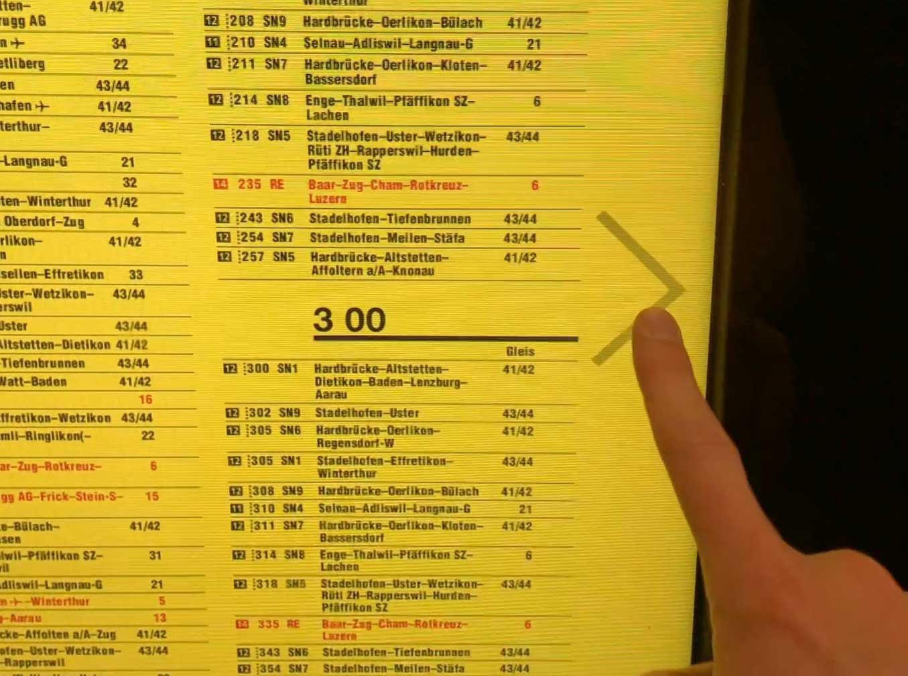
      <figcaption></figcaption>
    </figure>
  

  

    <figure>
      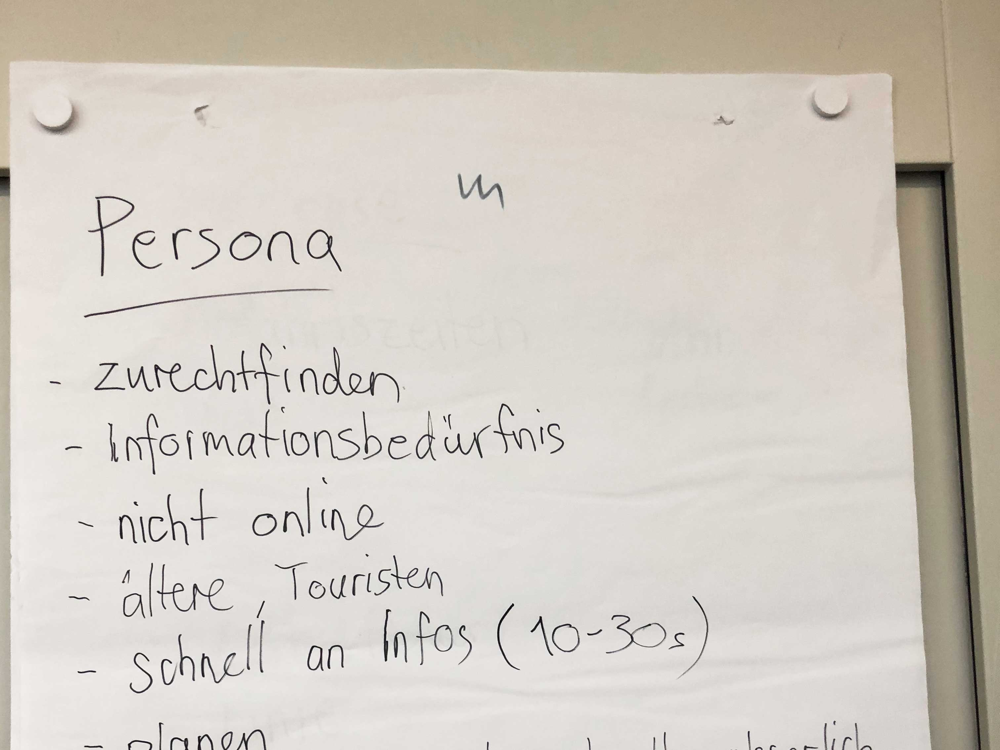
      <figcaption></figcaption>
    </figure>
  

  

    <h4>Zielgruppen/Persona</h4>
    <ul>
      <li>Personen mit Informationsbedürfins</li>
      <li>Personen ohne Smartphone oder dem Wissen um Online-Angebote</li>
      <li>Ältere Touristen</li>
      <li>Möchten Information innert 10–30 Sekunden</li>
      <li>Personen, die eine Fart antreten möchten</li>
      <li>Personen können Lesen, sind aber eventuell seh- oder bewegungsbeeinträchtigt</li>
      <li>Verschiedene Personen haben verschiedene Ansprüche an die Informationstiefe</li>
    </ul>
  

  

    <h4>Informationsbedarf</h4>
    <ul>
      <li>Abfartszeiten</li>
      <li>Gleis</li>
      <li>Streckenverlauf</li>
      <li>Dauer</li>
      <li>Linie (Name)</li>
      <li>Einschränkungen im Schienensystem</li>
      <li>Verpflegung/Restaurant</li>
      <li>Wo sind die Wagen der 1. oder 2. Klasse</li>
    </ul>
  

## Analyse zur Gestaltung
Die nachfolgende Analyse und die daraus erarbeiteten Vorschläge der Studenten beziehen sich lediglich auf den Teil der Abfahrtszeiten. Da es sich dabei wohl um einer der am häufigst benutzten Teile handeln dürfe, kann eine Interaktion von Vorteil sein.

  

    <figure>
      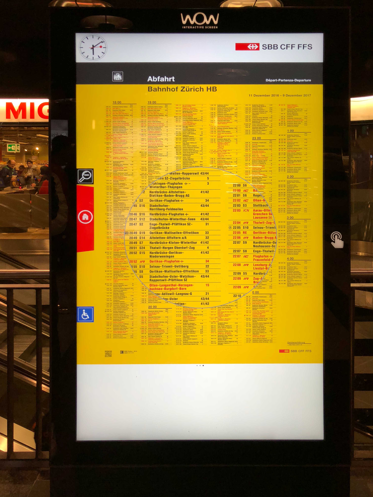
      <figcaption>Die Schriftgrösse auf dem Panel ist zu klein für die Auflösung des Screens und kann kaum gelesen werden. Mit einer «Lupe» kann man sich einzelne Teile vergrössert darstellen. </figcaption>
    </figure>
  

  

    <figure>
      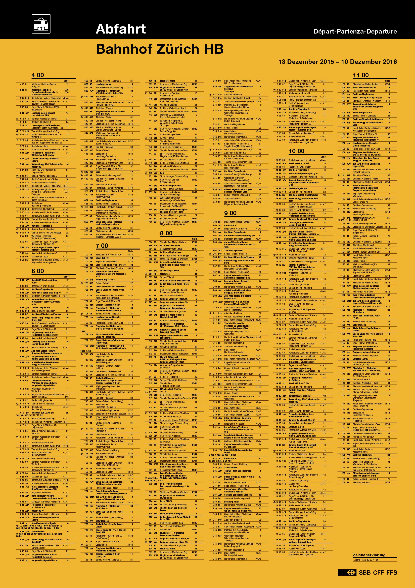
      <figcaption>Das Poster (hier in der Abbildung) diente ganz offensichtlich dem Screendesign als Vorlage</figcaption>
    </figure>
  

Die Gestaltung des Panels wurde ganz offensichtlich dem Poster der gedruckten Version angepasst oder übernommen. Wo in der gedruckten Version mit der hohen Auflösung die Schrift noch klar lesbar ist, versagt der niedrig aufgelöste Screen und die Schrift wird fast unlesbar. Die Abfahrttabelle ist auf mehere «Seiten» verteilt was ebenso 1:1 dem Poster entnommen wurde. Eine «Lupe» soll dieses Defizit ausbessern, wirkt aber Fremd und macht das Auffinden seiner Zugsverbindung noch schwieriger.

## Analyse zum Interface
Das Userinterface für die momentane Fahrplanauskunft besteht aus den folgenden Elementen:

* Blättern – vorwärts und zurück
* Lupe – ein und aus
* «Rollstuhl-Modus» – ein und aus
* Zurück auf Homescreen

#### Blättern
Das Blättern zwischen den drei Screens ist eher schwerfällig. Es muss relativ stark gedrückt werden und der Touch/Swipe wird nicht immer erkannt.

#### Lupe
Die Lupe verdeckt durch ihre eigene Grösse sehr viel Text. Eine Navigation innerhalb des Screens ist schwierig, da man den Finger bewegen muss und dabei die Lupe beobachten kann, nicht aber den Finger gezielt an eine Position bewegen, da die gesuchte Zeit durch die Lube eventuell verdeckt wurde.

#### Rollstuhl-Modus
Die Anordnung der Abfahrtszeiten zieht sich über ⅔ der Höhe des Screens dadurch wird es für Rollstuhlfahrende und kleine Personen schwierig die oberen Teile des Screens zu lesen. Da in der Gestaltung auf dies keine Rücksicht genommen wurde, wird mit einem Touch auf ein Rollstuhl-Icon der Screen herunter gefahren. Für ältere Personen, die am unteren Rand lesen möchten, sich aber nicht mehr Bücken können, gibt es keine Hilfe um die Gestaltung hoch zu stellen.

  

    <figure>
      
      <figcaption>Normale Ansicht</figcaption>
    </figure>
  

  

    <figure>
      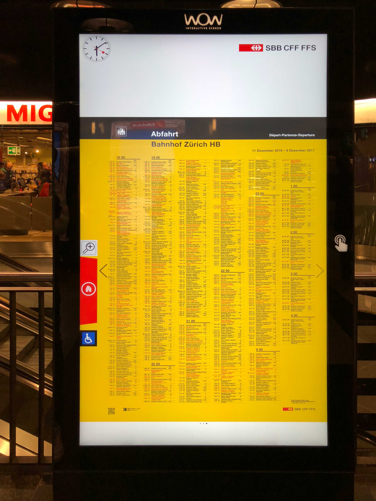
      <figcaption>«Rollstuhl-Modus»</figcaption>
    </figure>
  

#### Zurück/Home
Der Home-Button ist rot unterlegt und mit einem Haus markiert. Die Symbolik und die positionierung scheinen in Ordnung.

 
 
 

## Redesign
Die Betrachtung vor Ort, Analyse und das Redesign des Panels erfolgte innert 8 Schullektionen. Somit blieb für die einzelnen Schritte nicht viel Zeit. Nachdem in der Klasse die Analyse des bestehenden Panels erfolgte, wurde folgender Zeitplan für den Rest des Tages eingehalten:

* Paper-Prototype (1h)
* Austausch und Präsentation in Klasse (45min)
* Entwurf (2:15h)
* Präsentation in der Klasse (1h)

  

    <figure>
      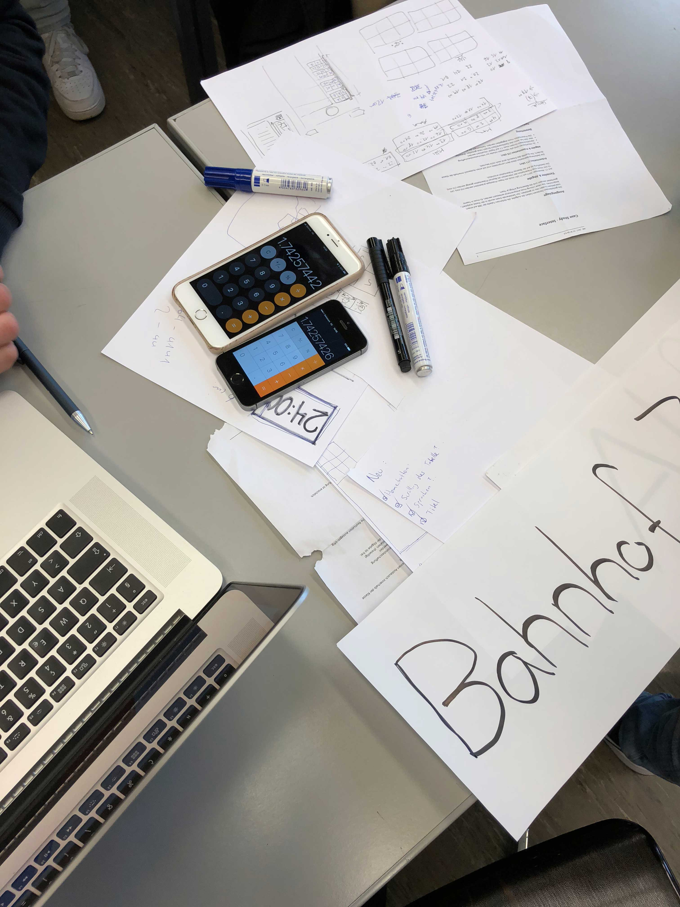
      <figcaption></figcaption>
    </figure>
  

  

    <figure>
      
      <figcaption></figcaption>
    </figure>
  

  

    <figure>
      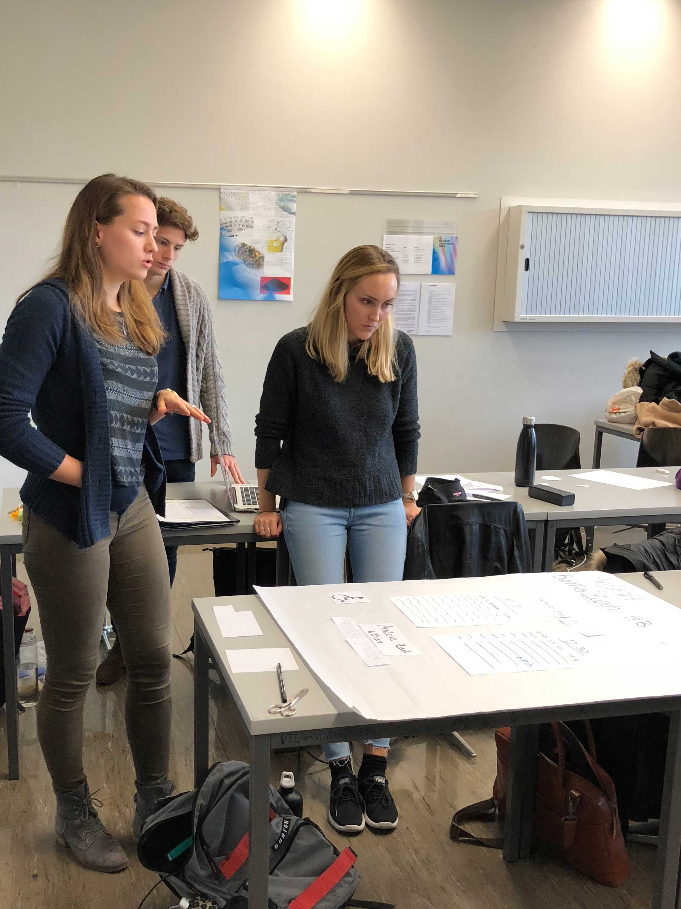
      <figcaption></figcaption>
    </figure>
  

  

    <figure>
      
      <figcaption></figcaption>
    </figure>
  

 
 
 

### Entwurf «Classic»
Pascale, Natascha und Nicole haben eine sehr reduzierte und einfache Form für das Interface gewählt. Der Entwurf kann grafisch und puncto Interface mit wenigen Korrekturen zu einer guten Lösung ausgebaut werden.

  

    <h3>Prototype</h3>
  

  

    <figure>
      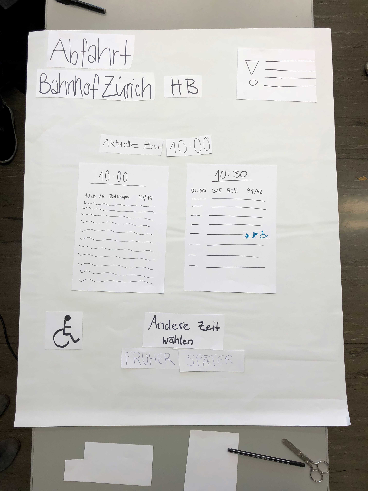
      <figcaption>Paper-Prototype ist noch in einem sehr rohen Zustand.</figcaption>
    </figure>
  

  

    <h4>Positives</h4>
    <ul>
      <li>Aktuelle Zeit gleich ersichtlich.</li>
      <li>Wenige Interface-Elemente die verwirren.</li>
      <li>Einschränkungen im Schienensystem gut ersichtlich.</li>
    </ul>
    <h4>Inputs/Verbessern</h4>
    <ul>
      <li>Eine Auswahl der Zeit einige Stunden später ist eher schwer möglich.</li>
      <li>Die Aufteilung der zwei Spalten müsste man noch einmal prüfen.</li>
      <li>Schrift ist eher klein.</li>
    </ul>
  

  

    <h3>Entwurf</h3>
  

  

    <figure class="border">
      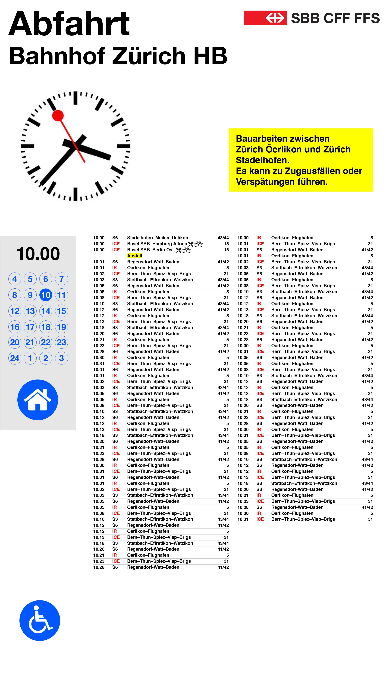
      <figcaption>Der Entwurf ist leicht verständlich und auf das wesentliche reduziert.</figcaption>
    </figure>
  

  

    <h4>Positives</h4>
    <ul>
      <li>Schnelle Stundenwahl</li>
      <li>Klares Interface-Konzept</li>
      <li>Störungen gut erkennbar</li>
    </ul>
    <h4>Inputs/Verbessern</h4>
    <ul>
      <li>Die Schriftgrösse der Züge ist zu klein</li>
      <li>Eine Zeitmarke, wo die aktuell Zeit gerade steht, würde helfen</li>
      <li>Funktion der grauen Fläche (links) müsste noch geprüft werden.</li>
      <li>Button (Haus- & Rollsthul-Icon) haben die selbe Erscheinung wie Statuswahl (10 Uhr). Verschiedene Funktion, verschiedene Erscheinung.</li>
      <li>Bei der Wahl der Uhrzeit links ist es eher schwer zu erkennen, dass es sich um Uhrzeiten handelt.</li>
      <li>Die beiden Spalten sind eher eng beieinander.</li>
    </ul>
    <h4>Übersicht</h4>
    

      ★★★★★ – Technische Realisierbarkeit 
      ★★★★☆ – Inhaltliche Struktur 
      ★★★☆☆ – Interaktion/Führung 
      ★★★★☆ – Grafisches Konzept 
    

  

 
 
 

### Entwurf «Simple»
Wolfgang, Nils, Nadia und Lars haben einen Entwurf erarbeitet, bei dem die Wahl der Zeit möglichst einfach geschehen soll. Die Wahl ist mehrfach geführt (Stunde, Jetzt, Zeitwähler) und man müsste mit einer Testgruppe prüfen, ob dies verwirrend oder unterstützend ist.

  

    <h3>Prototype</h3>
  

  

    <figure>
      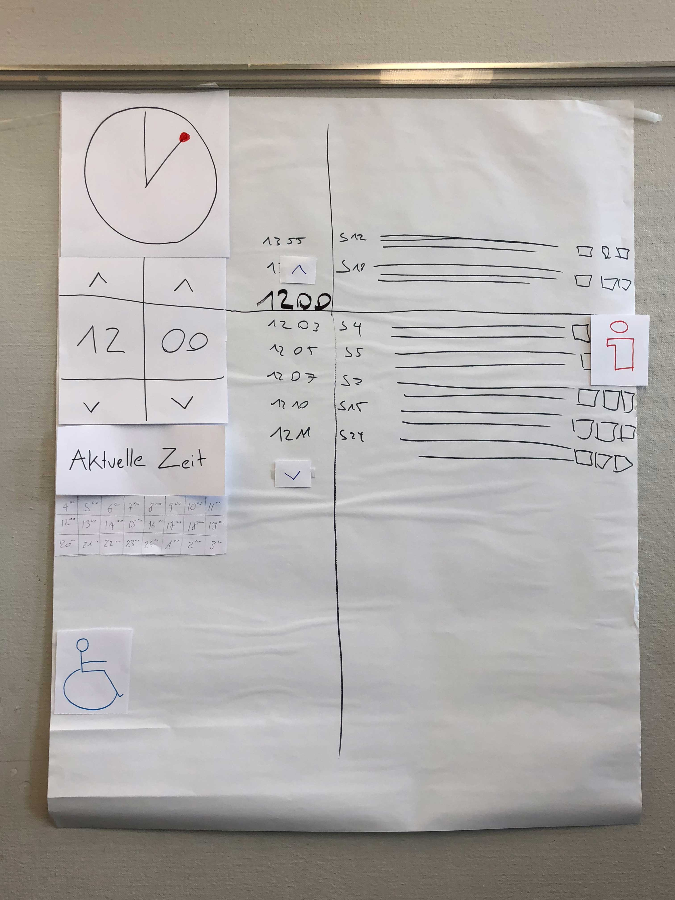
      <figcaption>Paper-Prototype zeigt, dass die Navigation durch die Zeit das Hauptthema ist.</figcaption>
    </figure>
  

  

    <h4>Positives</h4>
    <ul>
      <li>Lesbarkeit des Panels gegeben. </li>
      <li>Klarer Aufbau zwischen Navigation (Touch) und Informationsanzeige.</li>
      <li>Scrolling in der Zeit klarer von Zeitwahl unterscheiden.</li>
    </ul>
    <h4>Inputs/Verbessern</h4>
    <ul>
      <li>Uhr oben sehr präsent.</li>
      <li>Home-Button nicht vergessen.</li>
      <li>Touch grössen nicht zu klein wählen.</li>
      <li>Dreifache Zeitwahl (Stunde, Jetzt, Zeitwähler) schlüssig? </li>
    </ul>
  

  

    <h3>Entwurf</h3>
  

  

    <figure class="border">
      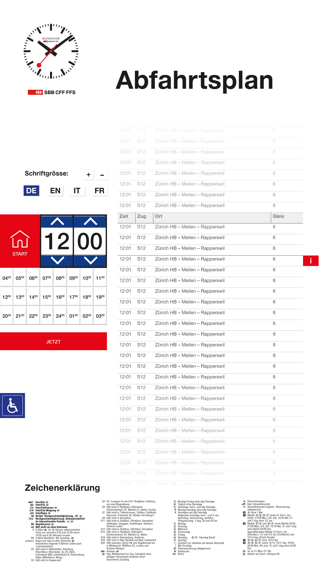
      <figcaption>Der Entwurf fokussiert auf die aktuellen Abfahrtszeiten und ermöglicht eine gezielte Wahl der Anzeigezeit.</figcaption>
    </figure>
  

  

    <h4>Positives</h4>    
    <ul>
      <li>Auffindbarkeit für Züge in den nächsten Minuten gegeben.</li>
      <li>Klare Typografie und strukturierter Aufbau.</li>
      <li>Vertraute Elemente vom Interface-Design wurden verwendet.</li>
    </ul>
    <h4>Inputs/Verbessern</h4>
    <ul>
      <li>Die Schriftgrösse der Züge ist zu klein</li>
      <li>Es gibt Blau, was als Status benutzt wird (bei DE) aber auch als Button (Rollsthul-Icon und Pfeile). Verschiedene Funktion, verschiedene Erscheinung.</li>
      <li>Der nächste abfahrende Zug ist ersichtlich anhand der «Legende». Diese Markierung könnte man so verstärken, dass klar wird alle über der Legende sind bereits gefahren.</li>
      <li>Zeichenerklärung sollte allenfals bei den Zügen integriert werden (Informationserschliessung über Touch)</li>
    </ul>
    <h4>Übersicht</h4>
    

      ★★★★★ – Technische Realisierbarkeit 
      ★★★★☆ – Inhaltliche Struktur 
      ★★★★☆ – Interaktion/Führung 
      ★★★★☆ – Grafisches Konzept 
    

  

 
 
 

### Entwurf «Slide»
Stephanie, Matthias und Marc haben einen Entwurf erarbeitet, in der die Zeitnavigation hinter die Information zurück tritt. Die ursprüngliche Idee, Vormittag und Nachmittag zu trennen, wurde im ausgearbeiteten Entwurf zu gunsten der Benutzerführung verworfen.

  

    <h3>Prototype</h3>
  

  

    <figure>
      
      <figcaption>Der Paper-Prototype hat noch eine Aufteilung des Tages (Zeit) in zwei Spalten.</figcaption>
    </figure>
  

  

    <h4>Positives</h4>
    <ul>
      <li>Grosse Typografie, Lesbarkeit</li>
      <li>Sprachwal bedacht. Aber wirklich nötig?</li>
      <li>Information hat die höhere Priorität als Interaktion. Passt wohl für viele, die den Zug in den nächsten Minuten suchen.</li>
    </ul>
    <h4>Inputs/Verbessern</h4>
    <ul>
      <li>Ist die Aufteilung Vormittag/Nachmittag schlüssig?</li>
      <li>Braucht es die Font-Skallierung? Oder nicht besser eine «gute» Grösse?</li>
      <li>Um eine Uhrzeit in der Zukunft zu wählen, muss unter umständen sehr oft getoucht werden.</li>
    </ul>
  

  

    <h3>Entwurf</h3>
  

  

    <figure class="border">
      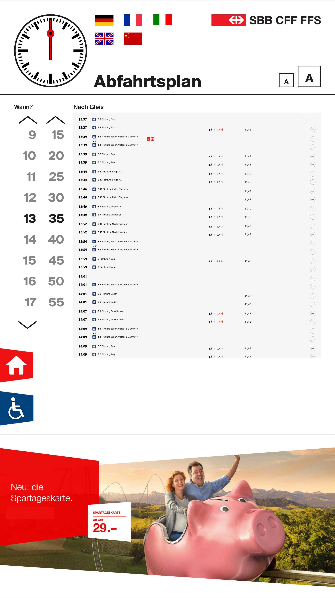
      <figcaption>Der Entwurf kann mit wenigen Korrekturen zu einem tollen Panel ausgebaut werden.</figcaption>
    </figure>
  

  

    <h4>Positives</h4>
    <ul>
      <li>Eine Zeitmarke, wo die aktuell Zeit gerade steht, würde helfen</li>
      <li>Vertraute Elemente vom Interface-Design wurden verwendet. </li>
      <li>Informationserschliessung über +-Symbol erweiterbar.</li>
    </ul>
    <h4>Inputs/Verbessern</h4>
    <ul>
      <li>Die Schriftgrösse der Züge ist zu klein</li>
      <li>Die Zeitwahl ist in der Höhe verteilt; dadurch erschwert man die Bedienung für kleinere Menschen.</li>
      <li>Für die Zeitwahl abweichend von «Jetzt» müssen unter umständen viele Touches gemacht werden.</li>
      <li>Sprachwahl und Schriftgrösse für kleinere Menschen nicht zu erreichen. «Rollsthul-Modus» wohl für viele Personen die einzige Möglichkeit.</li>
    </ul>
    <h4>Übersicht</h4>
    

      ★★★★★ – Technische Realisierbarkeit 
      ★★★☆☆ – Inhaltliche Struktur 
      ★★★☆☆ – Interaktion/Führung 
      ★★★★☆ – Grafisches Konzept 
    

  

 
 
 

### Entwurf «One-Touch»
Tioe, Severin und Marius haben durch eine geschickte Aufteilung des Tages eine sehr klare Führung über die Zeit erreicht. Die Anzeige der Information wurde an die anderen Info-Screens im Zugsverkehr angelehnt.

  

    <h3>Prototype</h3>
  

  

    <figure>
      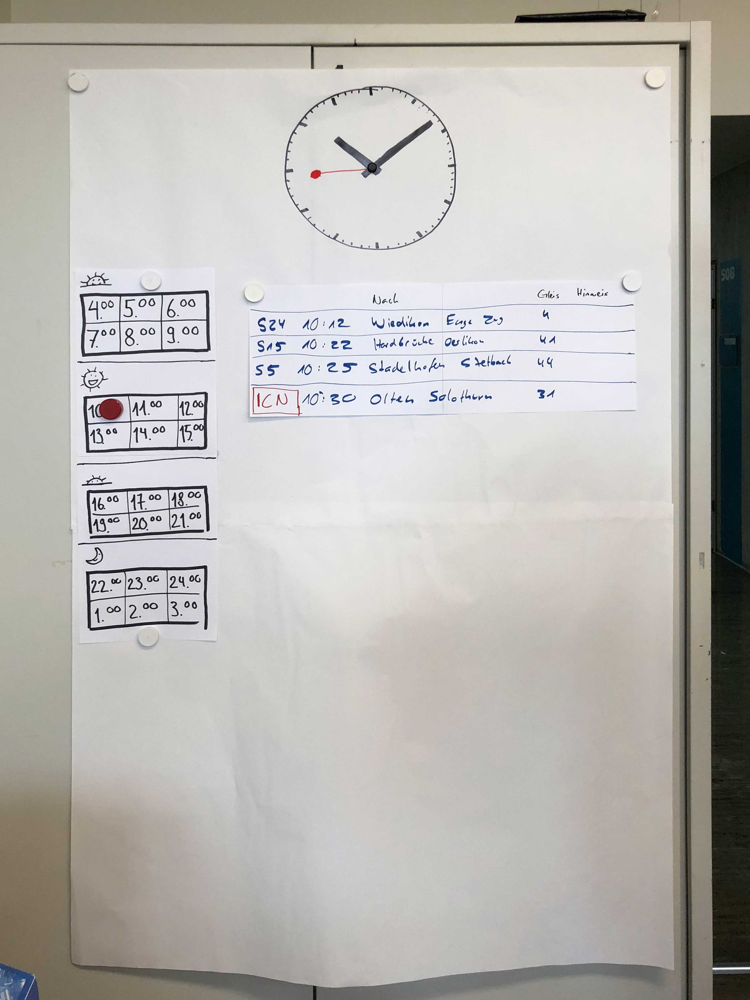
      <figcaption>Die Aufteilung des Tages in vier «Tageszeiten» ist im Paper-Prototye bereits ersichtlich.</figcaption>
    </figure>
  

  

    <h4>Positives</h4>
    <ul>
      <li>Klare Typografie und strukturierter Aufbau.</li>
      <li>Klares Interface-Konzept</li>
      <li>Schnelle Stundenwahl</li>
      <li>Die 4 Blöcke für die Tageszeiten funktionieren sehr gut!</li>
    </ul>
    <h4>Inputs/Verbessern</h4>
    <ul>
      <li>Eine Zeitmarke, wo die aktuell Zeit gerade steht, würde helfen.</li>
      <li>Können vielleicht noch mehr Informationen erschlossen werden?</li>
    </ul>
  

  

    <h3>Entwurf</h3>
  

  

    <figure class="border">
      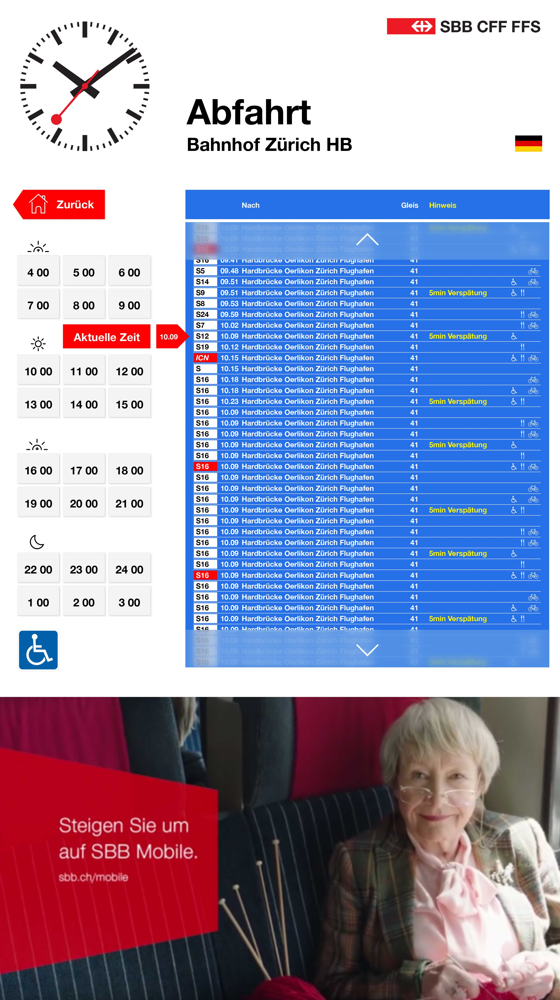
      <figcaption>Der fertige Entwruf führt den Benutzer über die klare Zeitnavigation schnell zu den gewünschten Abfahrtszeiten.</figcaption>
    </figure>
  

  

    <h4>Positives</h4>
    <ul>
      <li>Typografie der Züge eher klein.</li>
      <li>Information und Interaktion sind optisch gut getrennt.</li>
      <li>Es gibt ein Haupt-Interface (Zeitwahl) und dieses wurde sehr klar gestaltet.</li>
      <li>Das Blau für Info-Displays der sonstigen Anzeigen im Bahnhof wurde übernommen.</li>
    </ul>
    <h4>Inputs/Verbessern</h4>
    <ul>
      <li>Die Tageszeiten sind durch die starke Block-Bildung im Entwurf fast besser erkennbar.</li>
      <li>Zeitmarke stört den sonst sehr klaren Aufbau. Kann aber leicht korrigiert werden.</li>
      <li>Scroll-Up und -Down sind nun sehr weit auseinander. Grosse Bewegung und hoch oben.</li>
    </ul>
    <h4>Übersicht</h4>
    

      ★★★★★ – Technische Realisierbarkeit 
      ★★★★☆ – Inhaltliche Struktur 
      ★★★★☆ – Interaktion/Führung 
      ★★★☆☆ – Grafisches Konzept 
    

  

