## Intro
Kollaboratives Arbeiten mittels Software bietet viele Chancen für verteilte Gruppen, sich trotz räumlicher Distanz zu ergänzen oder am selben Ort gleichzeitig einen Effort zu leisten. Die Opensource-Software [Etherpad](http://etherpad.org/) bietet hierzu einen einfachen Einstieg, wenn es um Texterstellung geht. Doch ist das freie Produkt für gewisse Anforderungen fast zu einfach gestrickt.

### Struktur
Etherpad kann beim installieren verschieden konfiguriert werden. So hilft es zum Beispiel für strukturierte Texte dem Benutzer die Möglichkeit zu geben, Titel einzufügen. Für andere Bereiche bietet die Software dem Benutzer keine visuelle Hilfe, sondern der Text dient als universelle «Schnittstelle».

  

    <figure>
      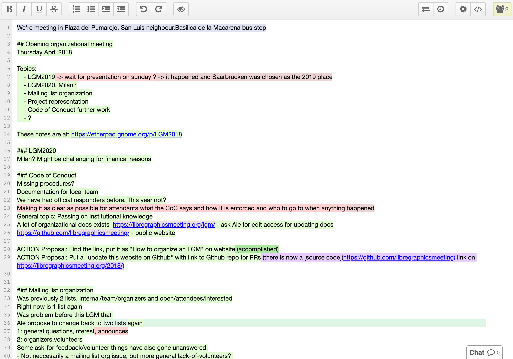
      <figcaption>Installation von Etherpad ohne Titel-Optionen</figcaption>
    </figure>
  

  

    <figure>
      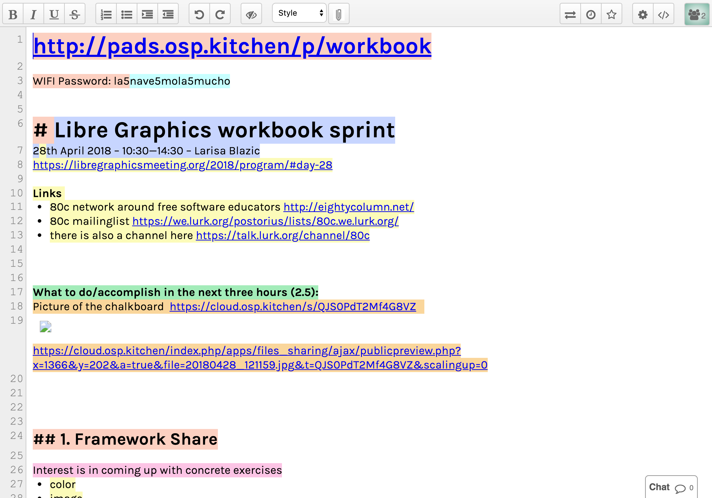
      <figcaption>Installation von Etherpad welche Titel erlaubt</figcaption>
    </figure>
  

## Probleme
So vielfältig wie die Anwendungen, so divers sind auch die Probleme mit Etherpad. Die Nachfolgenden Probleme wurden für den durchgeführten Tag in den Fokus genommen:

* Persönliche, für andere nicht sichtbare Kommentare/Dokumente/Notizen müssen ausserhalb von Etherpad erfasst werden und können dem Dokument nicht im Kontext mitgegeben werden. Persönliche Anreicherung des Dokuments soll möglich sein. Die Lösung, die für dieses Problem gefunden wird, sollte auch für öffentliche (also für Alle sichtbare) Anreicherungen funktionieren.
* Aus dem Text resultierende Aufgaben sind nicht ohne den Text vertieft zu lesen ersichtlich und es gibt keine Fortschrittsanzeige über bereits erledigte Aufgaben.

## Analyse
Nach einer kurzen Einführung wurde von den Studierenden eine Analyse zu bereits bestehenden Software Produkten gemacht, welche dann im Kollektiv besprochen wurden.

### Analysierte Produkte

* [Dropbox Paper](https://www.dropbox.com/paper)
* [HackMD](https://hackmd-ce.herokuapp.com/)
* [Github Issues](https://github.com/ianstormtaylor/slate/issues)
* [Atlassian Confluence](https://www.atlassian.com/software/confluence)

### Dropbox Paper
- Starke Kommentarfunktion (einzelne Wörter oder Zeilen können kommentiert werden)
- ToDo's können direkt im Dokument vergeben werden – Nutzer werden benachrichtigt.
- Möglichkeiten zum Einfügen weiterer Inhalte (Bilder, Tabellen, ...) sind sehr gut integriert.

### HackMD
- Eingabe erfolgt mittels der Auszeichnungssprache Markdown
- Für normale Benutzer schwierig in der Anwendung
- Direkte Integration mit GitHub um mittels [Gist](https://gist.github.com/) Daten (privat) zu speichern
- Keine Kommentarfunktion
- Integration verschiedenster Dienste für Video/Slideshows/Bilder
- Automatische Navigationserstellung (Table of Content)

### Confluence
- Kostenpflichtig
- Funktioniert am besten mit anderen Produkten von [Atlassian](https://www.atlassian.com/) (Jira & Confluence)
- Keine Kommentarfunktion direkt im Confluence (Kommentare müssen im Jira hinzugefügt werden)
– Keine privaten Kommentare

### Github Issues
- Keine Echtzeit-Editierung mit anderen Personen
- Ein Repository beinhaltet «Issues»
- Über Issues können Aufgaben erstellt werden
- Personen und Teams können zu Issues zugewiesen werden
- Issues sind in Milestones zusammengefasst (mit Fortschrittsanzeige)
- Milestones können terminiert werden
- Issues können nach Milestones und Labels sortiert werden

## Redesign

### Entwurf «Fokus»
Severin, Nicole und Matthias haben einen [Entwurf](https://xd.adobe.com/view/8f4b8631-affd-40d3-67a1-60f145ddacdc-f97a/) erarbeitet, bei dem der Fokus zentral auf dem Text liegt und die Userinterface-Elemente sind nur kontextsensitiv zu sehen.

  

    <figure>
      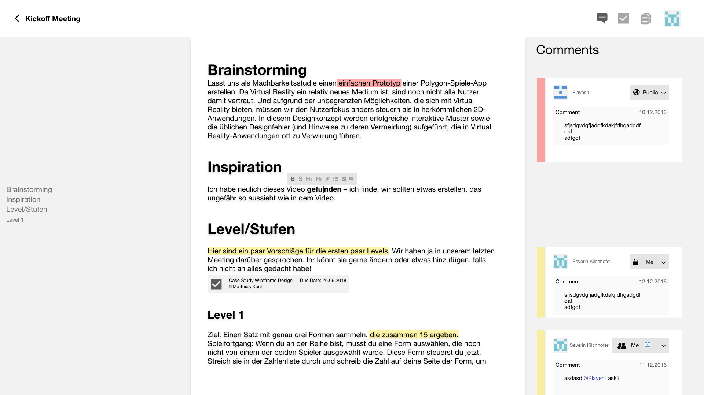
      <figcaption>Kommentarfunktion</figcaption>
    </figure>
  

  

    <figure>
      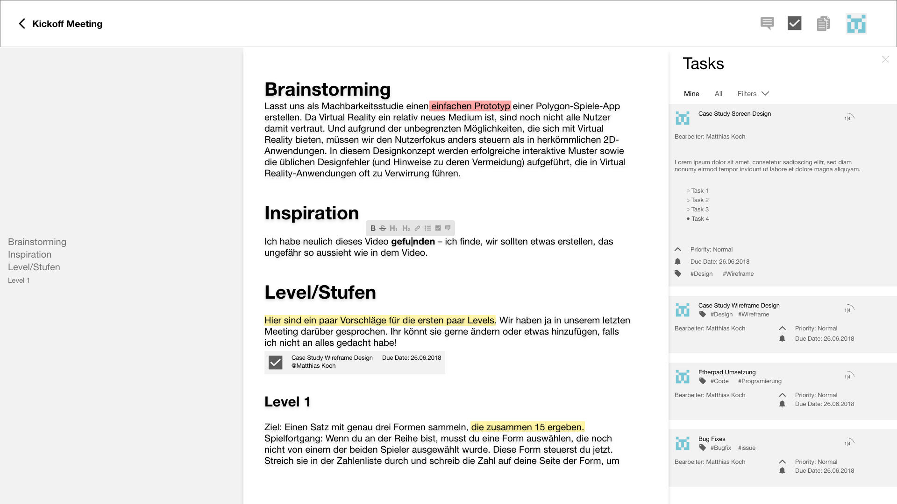
      <figcaption>Aufgabenverwaltung</figcaption>
    </figure>
  

#### Positives

* Klares Interface-Konzept
* kontextsensitive Formatierung
* Inhaltsverzeichnis hilft beim Navigieren im Dokument
* Taskverwaltung sehr ausgefeilt
* Gute Sichtbarkeit von Public/Private in Kommentaren

#### Inputs/Verbessern

* Die Erstellung von Kommentaren und Aufgaben ist noch nicht gezeigt (Ansicht schon).
* Farbsystem für Kommentare (nebst Avatar) allenfalls auch für Aufgaben nutzen.

#### Übersicht

★★★★★ – Technik  
★★★★☆ – Inhalt  
★★★★☆ – Interaktion/Führung    
★★★★☆ – Konzept

## Redesign

### Entwurf «Sidebar»
Der Entwurf von Nils, Lars, Marius, Natasha basiert auf einem Sidebar, der sich für Kommentare, Dateien und Aufgaben nutzen lässt. Die Erstellung erfolgt mit einem Layover direkt im Text.

  

    <figure>
      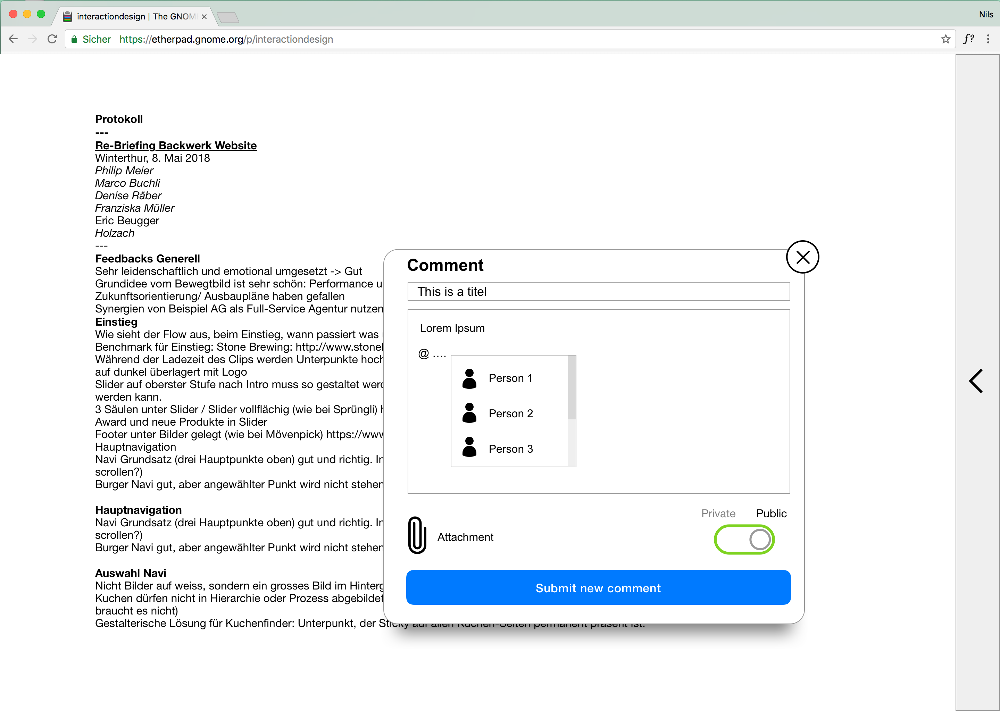
      <figcaption>Kommentar einfügen</figcaption>
    </figure>
  

  

    <figure>
      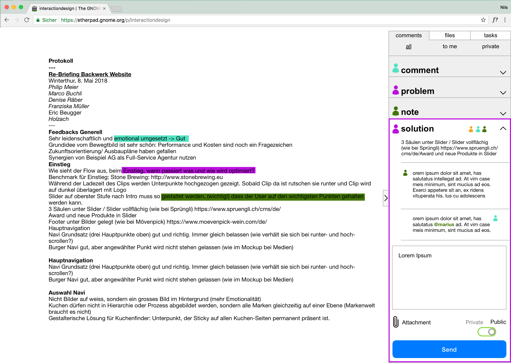
      <figcaption>Kommentare anzeigen</figcaption>
    </figure>
  

  

    <figure>
      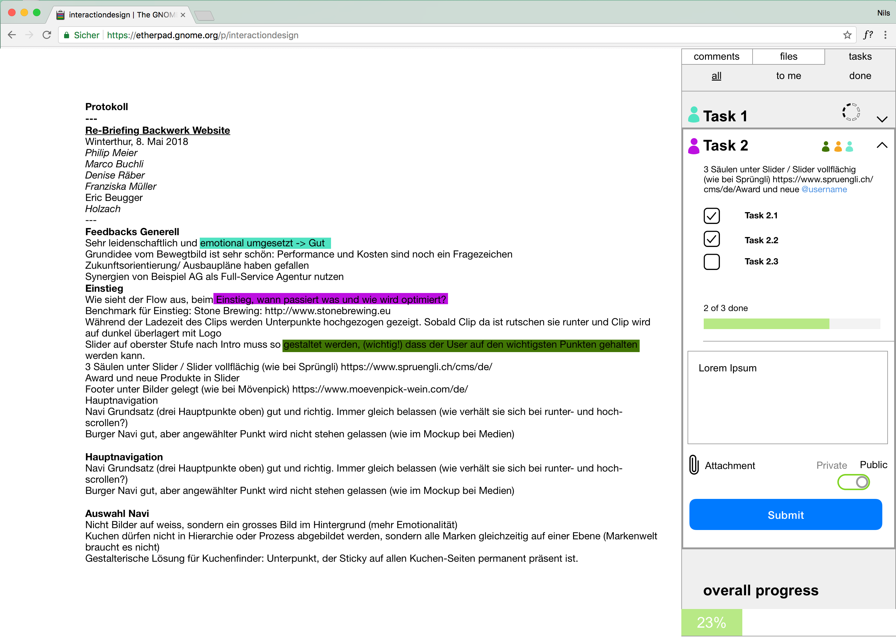
      <figcaption>Aufgaben anzeigen</figcaption>
    </figure>
  

#### Positives

* Klares Interface-Konzept
* kontextsensitive Formatierung
* Inhaltsverzeichnis hilft beim Navigieren im Dokument
* Taskverwaltung sehr ausgefeilt
* Gute Sichtbarkeit von Public/Private in Kommentaren

#### Inputs/Verbessern

* Public und Private ist mit dem Schiebeschalter nicht 100% verständlich, was jedoch hier sehr wichtig ist. Allenfalls beser ein Dropdown.
* Tasks sind im Text nich ersichtlich (bei Kommentaren mit Farbe gelöst).
* Filterung von Aufgaben/Kommentaren visuell noch zu sehr wie ein Link.
* drei verschieden Symboliken (segmentierter Kreis, Balken in Anzahl Schritten, Balken in Prozent) für Fortschrittsanzeige wohl nicht ideal.
* Sehr lange Zeilen im Text. Allenfalls maximale Breite beschränken.
* Der eingeklappte Sidebar animiert nicht aufgemacht zu werden, da man nicht sieht, was sich dahinter verbirgt. Allenfalls gleich drei Icons für Kommentare, Files und Aufgaben dort einführen. Klick darauf öffnet gleich im richtigen Tab.

#### Übersicht

★★★★★ – Technik  
★★★☆☆ – Inhalt  
★★★☆☆ – Interaktion/Führung    
★★★★☆ – Konzept

### Entwurf «Trennung»
Tiö, Wolfgang und Marc haben ein Entwurf gemacht, bei dem sie die Trennung von öffentlichen und privaten Ergänzungen sehr klar getrennt haben. So sind die Notizen immer privat und die Kommentare immer öffentlich.

  

    <figure>
      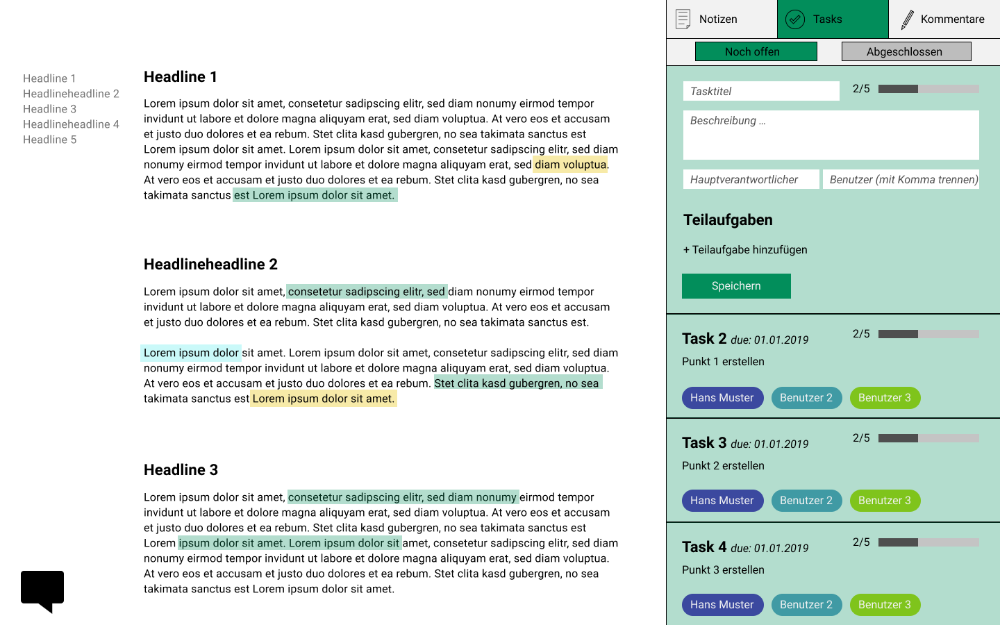
      <figcaption>Aufgaben einfügen</figcaption>
    </figure>
  

  

    <figure>
      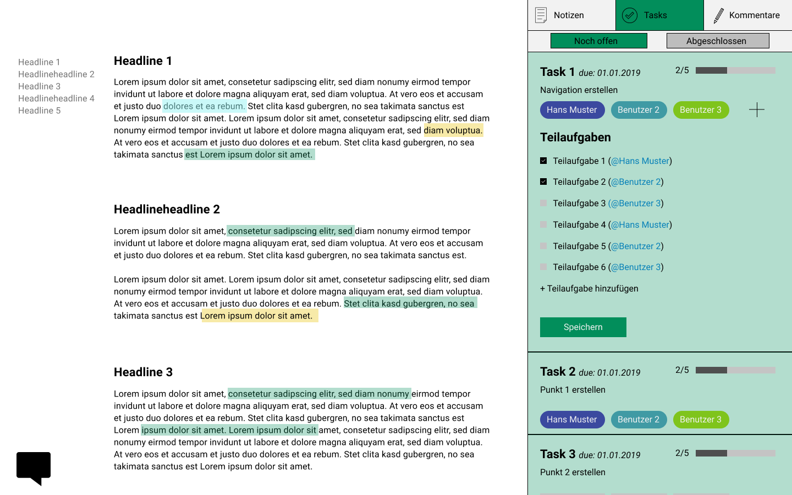
      <figcaption>Aufgaben anzeigen</figcaption>
    </figure>
  

  

    <figure>
      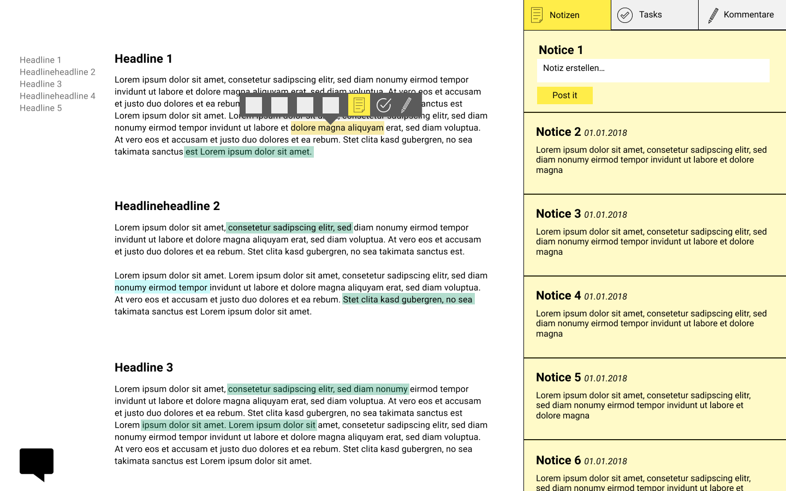
      <figcaption>Notizen einfügen</figcaption>
    </figure>
  

  

    <figure>
      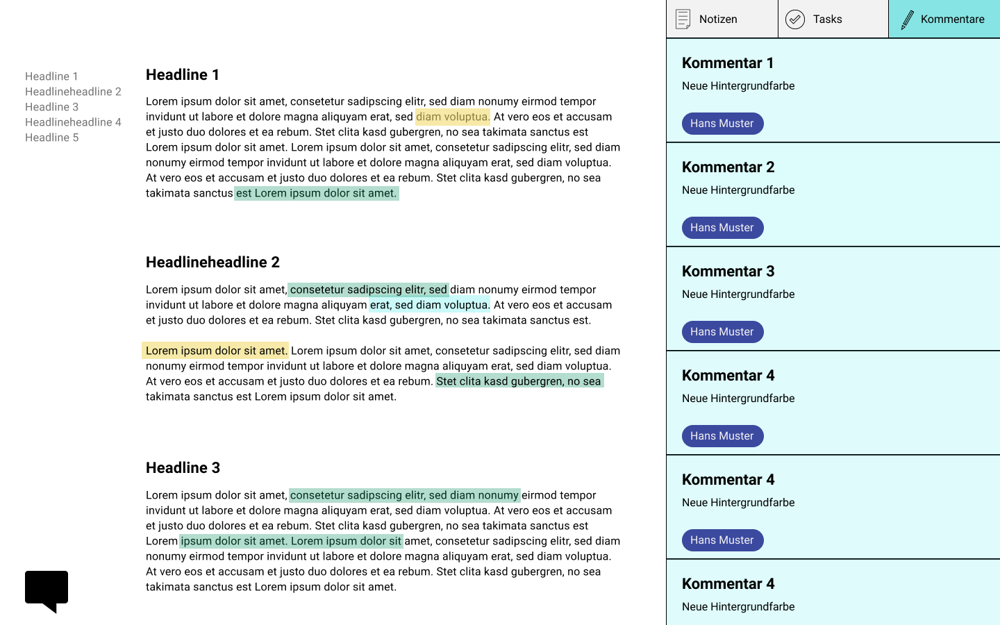
      <figcaption>Kommentare</figcaption>
    </figure>
  

#### Positives

* Klare Trennung von privaten und öffentlichen Ergänzungen
* Kontextsensitives Formatieren und Einfügungen von Ergänzungen
* Inhaltsverzeichnis hilft beim Navigieren im Dokument

#### Inputs/Verbessern

* Man müsste im Interface trotzdem noch einmal erklären, dass Notizen privat und Kommentare öffentlich sind (da sehr wichtig nicht zu verwechseln).
* Visuell hätte man im Text für Tasks wohl noch mehr Infos anzeigen können. Siehe Entwurf «Fokus»
* Durchgängige Bezeichnungen verwenden (Post it & Speichern)
* Hauptverantwortlicher und Benutzer in Ansicht nicht unterschieden (ausser Position)
* Muss man das Abhacke von Teilaufgaben wirklich speichern?
* Unterschiedliche Symbolik/Interface-Elemente für das hinzufügen von Personen und Teilaufgaben ungünstig
* Teils noch Fehler in den Mockups (Beispiel: beim erstellen der Aufgabe können nicht schon Teilaufgaben erledigt sein)

#### Übersicht

★★★☆☆ – Technik  
★★★☆☆ – Inhalt  
★★★☆☆ – Interaktion/Führung    
★★★★☆ – Konzept

## Fazit
An dieser Case Study ist der Unterschied von UX- und UI-Design exemplarisch erkennbar. Der Fokus lag klar auf dem UX-Design, sprich wie der User durch die Anwendung geführt werden soll. Selbstverständlich hat das Interface-Design auch seine Berechtigung, doch wird dieses weiter hinten angesiedelt. Erst muss klar sein, was die Applikation leisten soll und in einem zweiten Schritt geht es stärker um gestalterische Themen wie Typografie, Farbe usw. Schön zu sehen, was innerhalb eines Tages für Resultate vorliegen. Alle Gruppen haben eine Basis erarbeitet, auf welcher man gut weiterarbeiten kann. Zu gegebenem Zeitpunkt wäre sicher ein Usertest ein gewinnbringender Schritt – von Vorteil in möglichst frühem Statium mittels eines Prototypes oder Klickdummys. So kann festgestellt werden, wie der Enduser mit der Applikation zurecht kommt und wo er stoplert. Letztendlich liegt der Erfolg einer Applikation sowohl im Konzept als Genzes, wie auch im Kleinen, was Microinteracions und dergleichen anbelangt. Das Spielfeld des Interaction Designs ist gross…

Danke an Matthias Koch fürs mitschreiben der Analyse.
