## Ausgangslage
Die Firm [smide](https://smide.ch/) ist im Zentrum von Zürich seit dem Frühjahr 2017 mit «free floating» E-Bikes vertreten. Das heisst, Benutzer können mittels einer App auf ihrem Smartphone schauen, wo sich in ihrer Nähe ein E-Bike befindet, dies reservieren und später das Bike zu einem festgelegten Minutenpreis nutzen, bevor es wieder innerhalb der Innenstadt abgestellt werden kann. Das Stadtgebiet ist zwar fix definiert, jedoch kann innert diesem doch sehr grosen Gebiet das Bike frei zurück gegeben werden. Es gibt etwa 200 Bikes, welche in zwei Grössen angeboten werden.

  

    <h3>Bestehende Smide App</h3>
  

  

    <figure class="border">
      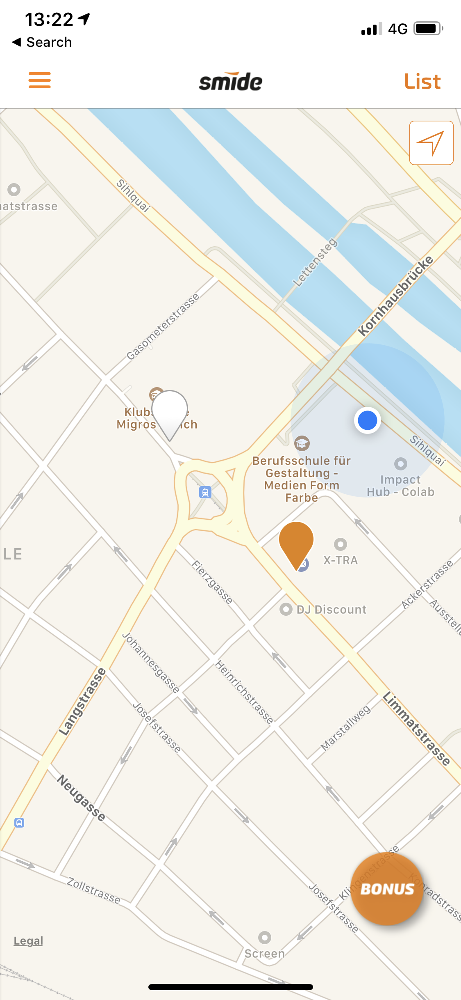
      <figcaption>suchen</figcaption>
    </figure>
  

  

    <figure class="border">
      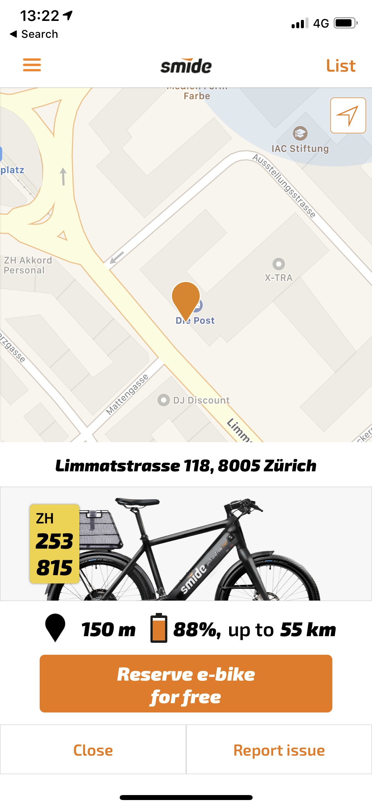
      <figcaption>wählen</figcaption>
    </figure>
  

  

    <figure class="border">
      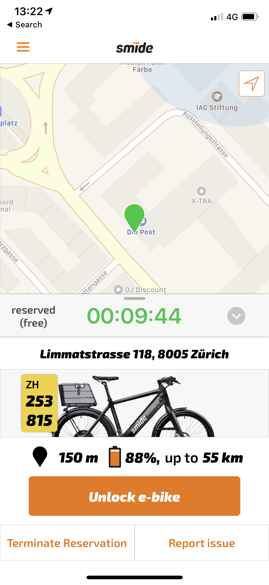
      <figcaption>reservieren</figcaption>
    </figure>
  

### Wayfinding auf einer Smartwatch
Als schulische Aufgabe – ohne Kontakt und Absprache mit Smide – sollte an diesem Tag eruiert werden, ob und wie sich der Prozess des Auffinden eines Fahrrads und das Buchen einer Fahrt mittels einer Smartwatch realisiert werden könnte. Das Wayfinding beschränkt sich also ausschliesslich auf das auffinden des Bikes und nicht später auf die Fahrt.

## Untersuchungen
Als Vorbereitung und Untersuchung zum Thema hatten die Studierenden verschiedene Tests gemacht, wie man sich im Raum orientiert und was Entscheidend bei der Navigation ist.

Es gab drei Gruppen:
* Navigation auf kleinem Raum (in Gebäude) mittels Zeichen und Sprache
* Navigation innerhalb von einem Umkreis von 200 Meter mittels Plan
* Navigation innerhalb von einem Umkreis von 400 Meter mittels Sprache

  

    <h3>Gezeichnete Pläne</h3>
  

  

    <figure class="border">
      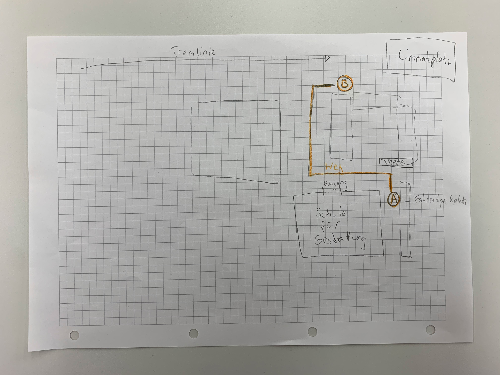
      <figcaption>Wichtige Eckpunkte eingezeichnet</figcaption>
    </figure>
  

  

    <figure class="border">
      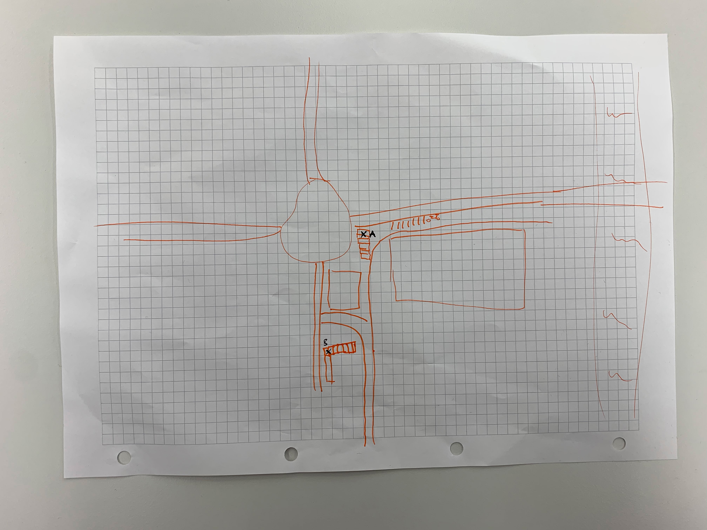
      <figcaption>Verzicht auf Text</figcaption>
    </figure>
  

### Skizzen
Die drei Gruppen arbeiteten nach den ersten Test zum Wayfinding an groben Entwürfen auf Papier. Dabei ging es darum die ersten Ideen visuell fest zu halten um danach im Klassenverband noch einmal einen Austausch zu pflegen.

  

    <figure class="border">
      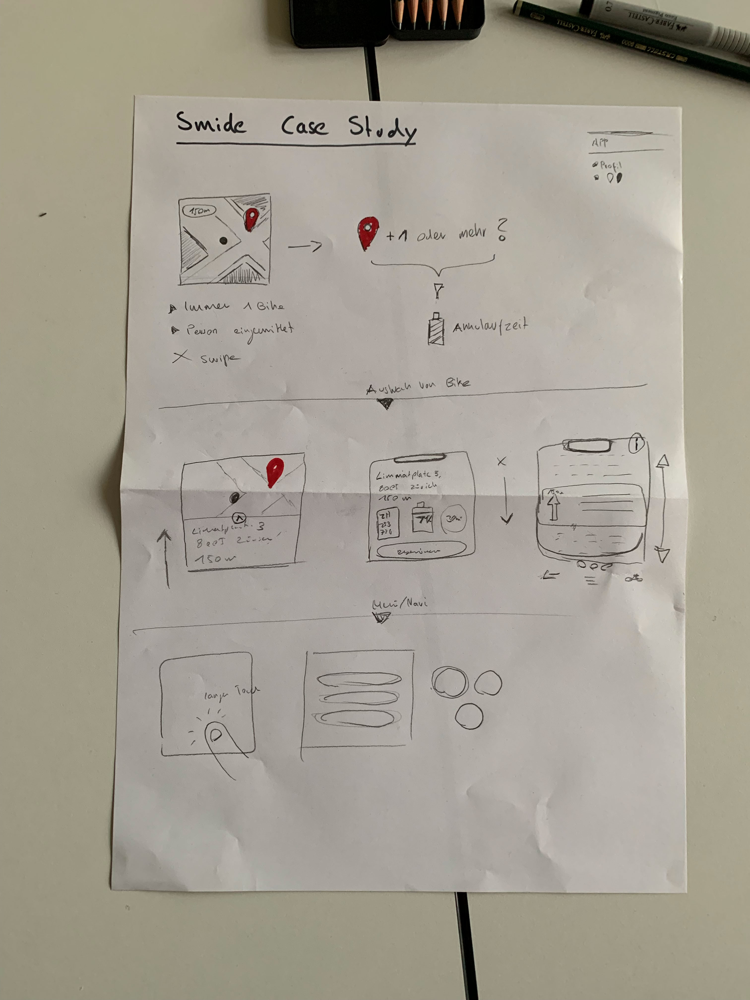
      <figcaption>suchen</figcaption>
    </figure>
  

  

    <figure class="border">
      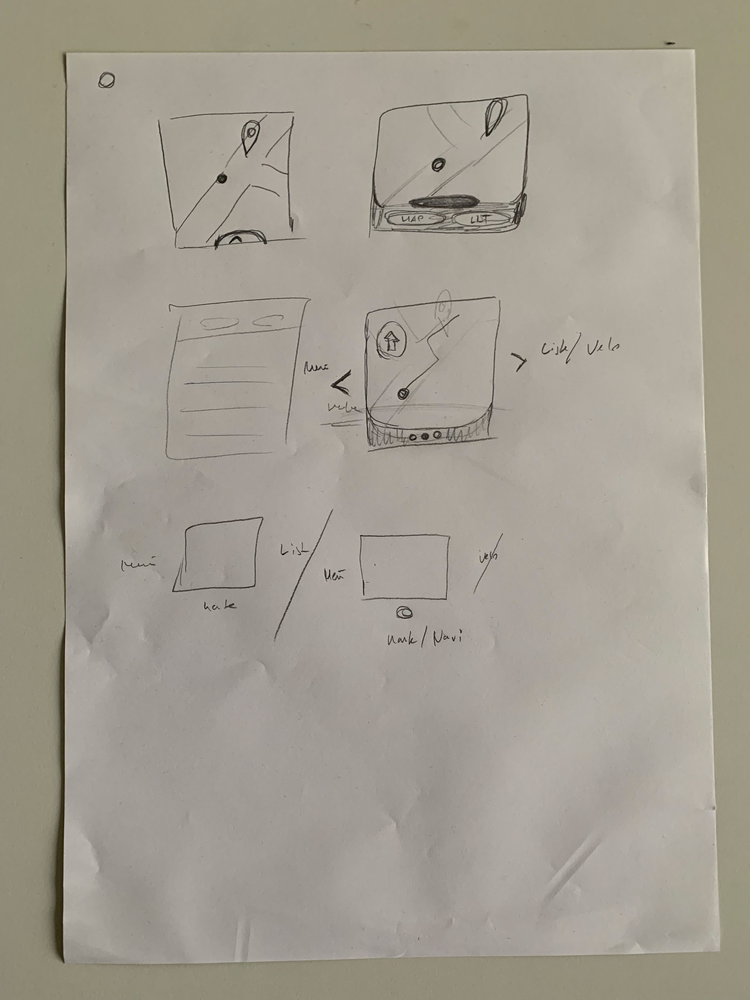
      <figcaption>wählen</figcaption>
    </figure>
  

## Entwürfe – Smartwatch
Die Entwürfe wurden innert kurzer Zeit am selben Nachmittag noch ausgearbeitet, so dass diese für eine Präsentation gezeigt werden konnten.

### Entwurf «keep it simple stupid»
Lars und Stephanie haben sich für eine Führung durch die Applikation entschieden, die mit 2 Touchs funktioniert, die jedoch mittels weiteren Interaktionen auch noch mehr Information oder mehr Funktionen erschliesst, die jedoch optional sind und nicht vom eigentlichen Vorgang des Wayfinding und der Buchung ablenken.

#### Positives
* Die Interaktion ist schlüssig und klar.
* Die Grafik wurde gut an die bestehende App angepasst.
* Sehr gute signalisation, in welcher Richtung das Bike steht
* Guter Kontextwechsel, wenn man dem Bike nahe kommt.

#### Inputs/Verbessern
* Die Art des Bikes (gross oder klein) ist nicht Sichtbar (wenn in Voreinstellung beide gewählt sind)
* Beim Wayfinding könnte man sich auch eine andere Informationsaufteilung vorstellen. Die Zeit, wie lange die Reservation noch läuft ist relativ wichtig (jetzt in Drawer zu finden), wo hingegen eine Postleitzahl wohl weniger wichtig ist (jetzt auf Hauptscreen).
* Kontostand wieviel Minuten ich noch fahren kann nicht ersichtlich

★★★★★ – Technische Realisierbarkeit 
★★★★☆ – Inhaltliche Struktur 
★★★★☆ – Interaktion/Führung 
★★★★★ – Grafisches Konzept 

#### Note 5.7

  

    <h3></h3>
  

  

    <figure class="border">
      
      <figcaption>Startscreen</figcaption>
    </figure>
  

  

    <figure class="border">
    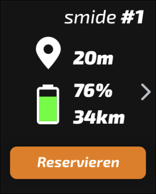
      <figcaption>Vorschlag für das nächste Bike</figcaption>
    </figure>
  

  

    <figure class="border">
    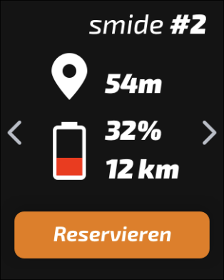
      <figcaption>Optional noch weiter Bikes</figcaption>
    </figure>
  

  

    <figure class="border">
    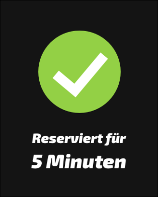
      <figcaption>Reservieren</figcaption>
    </figure>
  

  

    <figure class="border">
      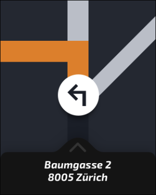
      <figcaption>Wayfinding</figcaption>
    </figure>
  

  

    <figure class="border">
    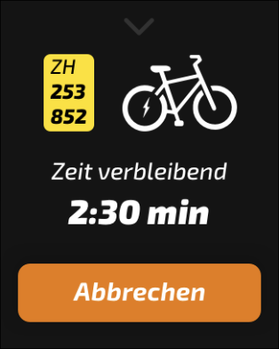
      <figcaption>Optional Infos zur Reservation</figcaption>
    </figure>
  

  

    <figure class="border">
    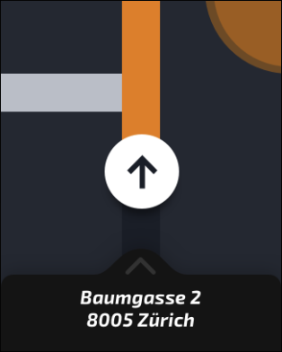
      <figcaption>Bike in der Nähe</figcaption>
    </figure>
  

  

    <figure class="border">
    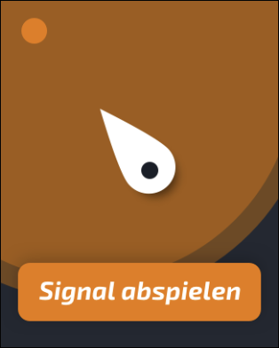
      <figcaption>Bike nah</figcaption>
    </figure>
  

  

    <figure class="border">
      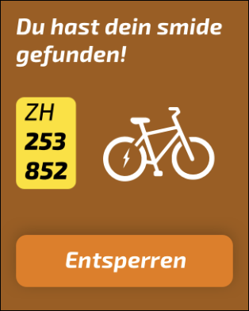
      <figcaption>Bike buchen</figcaption>
    </figure>
  

  

    <figure class="border">
    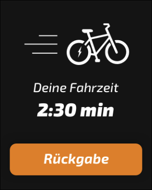
      <figcaption>Los!</figcaption>
    </figure>
  

  

    &nbsp;
  

  

    &nbsp;
  

### Entwurf «Hello!»
Nicole, Severin und Marc haben einen Entwurf gemacht, der durch eine persönliche Ansprache und deutlichen Buttons Lust macht sich sein Bike zu buchen.

#### Positives
* Persönliche Ansprache beim Startscreen mit integriertem Kontostand.
* Das nächste Bike wird vorgeschlagen, weitere Bikes aber doch möglich.
* Auch beim Abschluss der Buchung wieder eine verabschiedung.

#### Inputs/Verbessern
* Listendarstellung einmal mit orangen Pfeilen einmal ohne
* Wo sind aktive «Flächen» (Buttons) und was steht darauf noch einmal Prüfen. Danke-Button (?), und Listendarstellung bei der Bikewahl kann verbessert werden.
* Der Akkustand wird zwar angezeigt, aber was bedeutet das für die Fahrt? Wie weit kommt man damit?
* Die Distanz zum Ziel und der Akkustand könnten verwirren, da man sie gedanklich verbinden könnte.

★★★★★ – Technische Realisierbarkeit 
★★★★☆ – Inhaltliche Struktur 
★★★★☆ – Interaktion/Führung 
★★★★☆ – Grafisches Konzept 

#### Note 5.1

  

    <h3></h3>
  

  

    <figure class="border">
      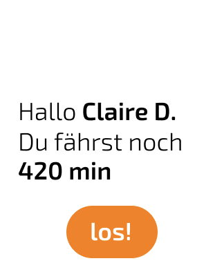
      <figcaption>Startscreen</figcaption>
    </figure>
  

  

    <figure class="border">
    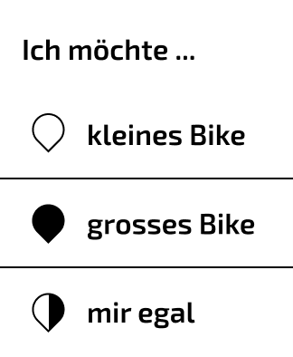
      <figcaption>Bikewahl</figcaption>
    </figure>
  

  

    <figure class="border">
    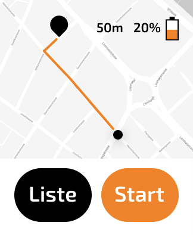
      <figcaption>Bike-Vorschlag</figcaption>
    </figure>
  

  

    <figure class="border">
    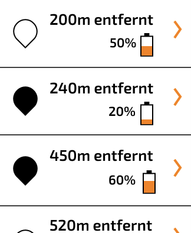
      <figcaption>Listendarstellung</figcaption>
    </figure>
  

  

    <figure class="border">
      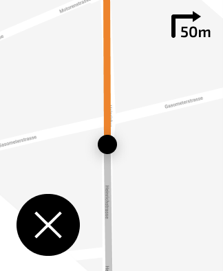
      <figcaption>Wayfinding</figcaption>
    </figure>
  

  

    <figure class="border">
    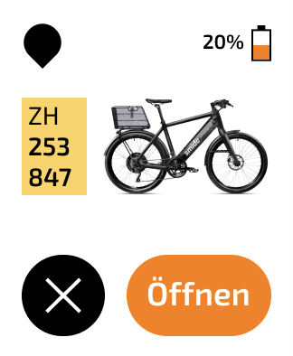
      <figcaption>Buchen</figcaption>
    </figure>
  

  

    <figure class="border">
    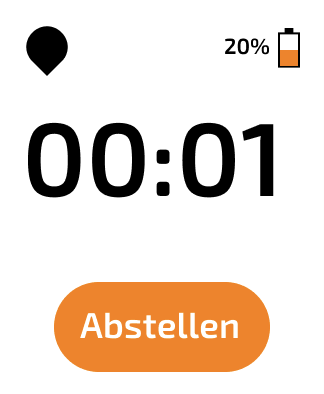
      <figcaption>Fahrzeit</figcaption>
    </figure>
  

  

    <figure class="border">
    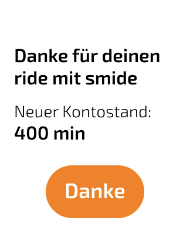
      <figcaption>Rückgabe</figcaption>
    </figure>
  

### Entwurf «Complete»
Pascale, Nils und Matthias haben als einzige Gruppe auch Settings in die App mit eingebaut. Die ganze Userführung und das UI orientieren sich sehr stark an der bestehenden App.

#### Positives
* Vertraute Konzepte (drei Punkte) wurden Eingesetzt um weitere Inhaltsebenen zu erschliessen.
* Drawer in der Reservation macht den Kontextwechsel (Wayfinding/Reservation) klar.

#### Inputs/Verbessern
* In der Listendarstellung wird der Akkustand nur als Prozentwert angezeigt, aber nicht in Kilomenter
* Die Kilomenter-Angabe mit dem Orangen-Kreis darum kann zu Verwechslungen mit Tempo-Angaben (auch rund und umkreist) führen.
* Wayfinding sehr klein und Karte nicht lesbar
* Unlock- und Abbrechen-Icon unklarer als Textbutton für Reservation. Wird beim Kreuz nun der aktuelle Screen verlassen oder die Reservation abgebrochen?
* Die drei Punkte funktionieren zwar, aber weshalb die Buchung nun dort ist, wo vorher die Liste war, ist unklar. Besser auch für die Buchung beim Drawer bleiben.

* Listendarstellung einmal mit orangen Pfeilen einmal ohne
* Wo sind aktive «Flächen» (Buttons) und was steht darauf noch einmal Prüfen. Danke-Button (?), und Listendarstellung bei der Bikewahl kann verbessert werden.
* Die Distanz zum Ziel und der Akkustand könnten verwirren, da man sie gedanklich verbinden könnte.

★★★★★ – Technische Realisierbarkeit 
★★★★☆ – Inhaltliche Struktur 
★★★☆☆ – Interaktion/Führung 
★★★☆☆ – Grafisches Konzept 

#### Note 4.7

  

    <h3></h3>
  

  

    <figure class="border">
      
      <figcaption>Startscreen</figcaption>
    </figure>
  

  

    <figure class="border">
    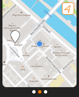
      <figcaption>Karte E-Bike Empfehlung</figcaption>
    </figure>
  

  

    <figure class="border">
    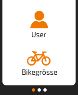
      <figcaption>Settings-Menü</figcaption>
    </figure>
  

  

    <figure class="border">
    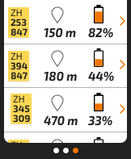
      <figcaption>Liste von weiteren E-Bikes</figcaption>
    </figure>
  

  

    <figure class="border">
      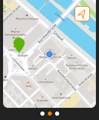
      <figcaption>Selektion</figcaption>
    </figure>
  

  

    <figure class="border">
    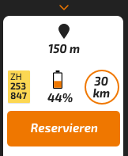
      <figcaption>Reservation</figcaption>
    </figure>
  

  

    <figure class="border">
    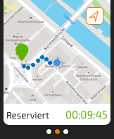
      <figcaption>Wayfinding</figcaption>
    </figure>
  

  

    <figure class="border">
    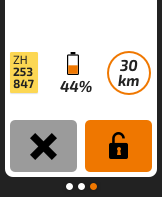
      <figcaption>Buchen</figcaption>
    </figure>
  

<!--
impressionen

IMG_8558.jpg

IMG_8559.jpg
-->

### Links
* [Aufgabestellung](https://github.com/logrinto/IAD2017.wayfinding)
