## Intro
Die Klasse hatte die Aufgabe, sich mit dem Thema «Küchenofen» zu beschäftigen und basierend auf einem Bedürfnisanspruch einen Funktionsumfang für «den idealen Backofen» im Schweizer Markt zu finden. Dabei musste einerseits der Umfang abgesteckt werden, andererseits musste jedoch vor allem dieser Funktionsumfang ideal in einem Interface zugänglich gemacht werden. Entwickelt wurden Ideen/Mockups und die einzelnen Teams waren angehalten sich selber in den Userflow einzudenken und aufgrund persönlicher Erfahrung Lösungen zu entwickeln, welche eine möglichst zugängliche Bedienung ermöglicht.

## Bestehende Systeme
Heutige Küchenofen haben einen sehr grossen Funktionsumfang, dem man im Interface-Design gerecht werden muss. Bestehende Lösungen sind nicht immer ideal um Personen auch ohne grosse Einarbeitungszeit (Lernphase) durch die Einstellungen zu führen.

<iframe src='https://www.youtube.com/embed/ziiJNZik6CY' frameborder='0' allowfullscreen></iframe>

## Einarbeitung
Da die einzelnen Studierenden aus sehr diversen Haushalten kommen, gab es eine Vielzahl von Erfahrungen und Geräten, die in Gruppen besprochen wurden. Darauf aufbauend und mit den Rahmenbedinungen der Vorgabe, wurde eine Strategie erarbeitet, welche Punkte man bei einem neuen Design verbessern möchte.

  

    <h3>Skizzen & Ideen</h3>
  

  

    <figure class="border">
      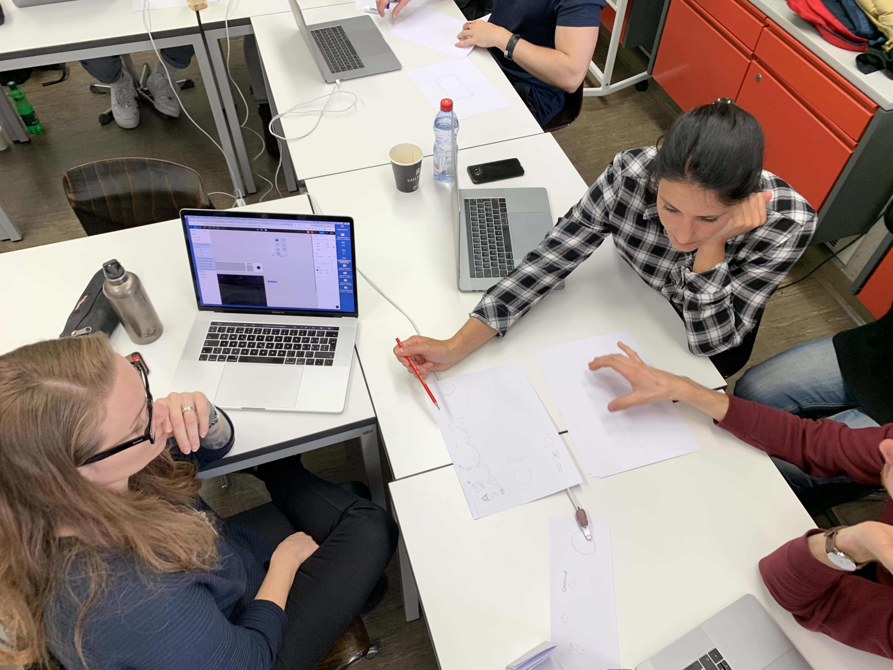
      <figcaption>&nbsp;</figcaption>
    </figure>
  

  

    <figure class="border">
      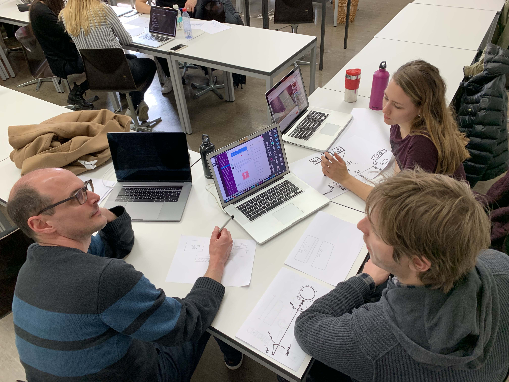
      <figcaption>&nbsp;</figcaption>
    </figure>
  

## Redesign
### Entwurf «Le Chef»
Severin, Natasha und Stephanie haben sich in ihrem Entwurf auf drei Hauptschritte für das Interface Design entschieden. Die Lösung wirkt klassisch und Aufgeräumt. Hinter jedem Schritt verbergen sich noch vertieftere Einstellungen, die über die Grundfunktion hinaus gehen.

  

    <h3>Interface</h3>
  

  

    <figure class="border">
      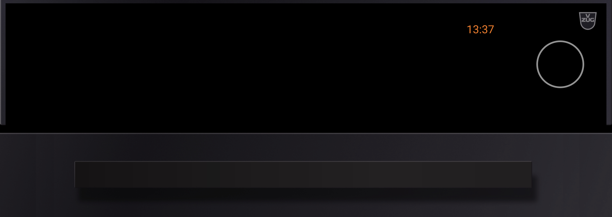
      <figcaption>Grundzustand</figcaption>
    </figure>
  

  

    <figure class="border">
      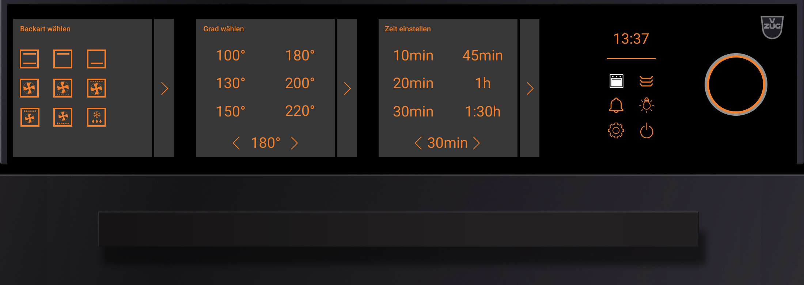
      <figcaption>Funktion Backofen</figcaption>
    </figure>
  

  

    <figure class="border">
      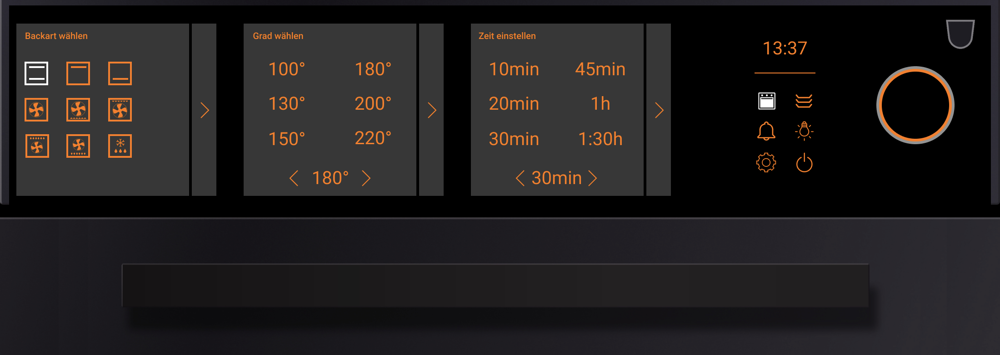
      <figcaption>Wahl des Modus</figcaption>
    </figure>
  

  

    <figure class="border">
      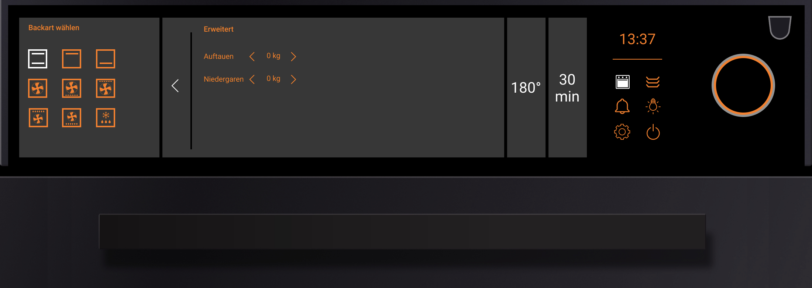
      <figcaption>Details zum Modus</figcaption>
    </figure>
  

  

    <figure class="border">
      
      <figcaption>Wahl der Temperatur</figcaption>
    </figure>
  

  

    <figure class="border">
      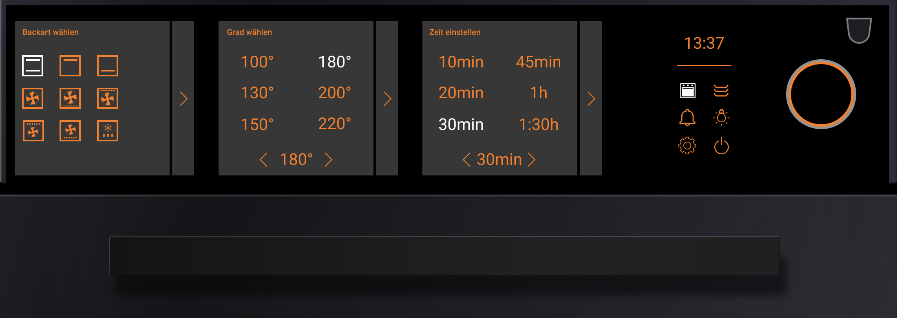
      <figcaption>Wahl der Zeit</figcaption>
    </figure>
  

  

    <figure class="border">
      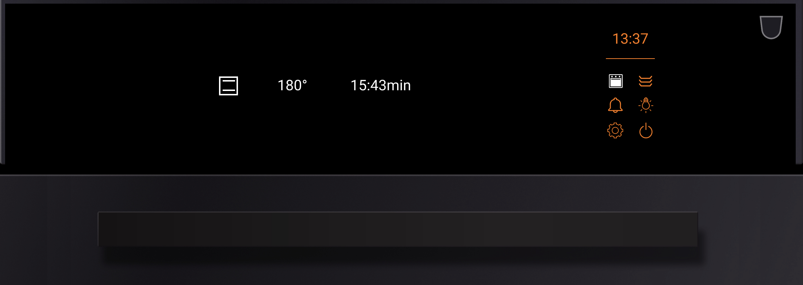
      <figcaption>Anzeige während dem Betrieb</figcaption>
    </figure>
  

  

    <figure class="border">
      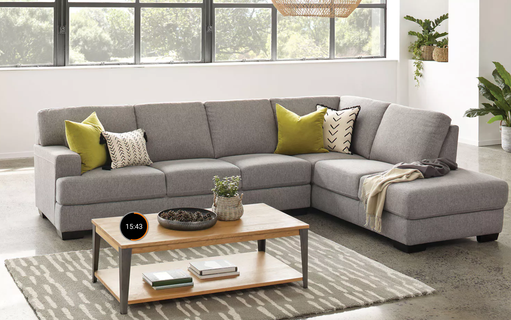
      <figcaption>Das Drehrad der rechten Seite kann vom Ofen gelöst werden und dient als Timer.</figcaption>
    </figure>
  

#### Positives
* Klare grafische Sprache
* Userführung einfach ersichtlich
* Der abnehmbare Timer hat eine gewisse Innovation/Neuheit die es in der Entwicklung zu Testen gilt
* Grafische Realisation bereits weit ausgearbeitet

#### Inputs/Verbessern
* Der Userflow ist von links nach rechts. Allenfalls hätte die Funktionswahl sich auch daran halten müssen
* Das bestehende Denkmodel (Modi, Temperatur, Zeit) wurde nicht erweitert oder alternative Zugangsschritte gezeigt (visualisiert). Funktioniert aber trotzdem.
* In der Ansicht zum Detail könnte man die anderen zwei Schritte getrost ausblenden. Diese sind im Moment nicht im Fokus.
* Die Typografie ist dezent. Allenfalls müsste aber die Grösse noch angepasst werden, damit auch Personen mit Sehschwäche einen guten Zugang haben.
* Timer müsste bei einer Produkteentwicklung noch ausgearbeitet werden.

#### Übersicht
★★★★☆ – Technik  
★★★★☆ – Inhalt  
★★★★☆ – Interaktion/Führung  
★★★★☆ – Konzept  

### Entwurf «Journey»
Das Team um Pascale, Tieu und Matthias haben in ihrem Entwurf versucht die Grundfunktion auf einen Screen zu platzieren und dabei vor allem die Zeit für die Zubereitung in einfacher Weise zugänglich zu machen

  

    <h3>Interface</h3>
  

  

    <figure class="border">
      
      <figcaption>Grundzustand</figcaption>
    </figure>
  

  

    <figure class="border">
      
      <figcaption>Hauptmenu</figcaption>
    </figure>
  

  

    <figure class="border">
      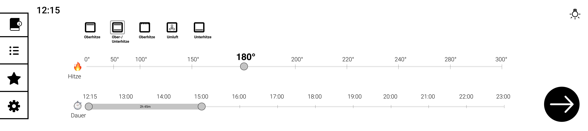
      <figcaption>Selektion von Modus, Temperatur und Zeit</figcaption>
    </figure>
  

  

    <figure class="border">
      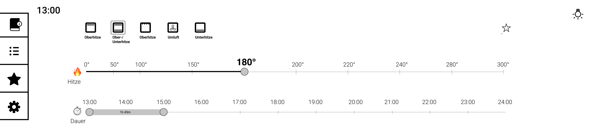
      <figcaption>Anzeige während dem Betrieb</figcaption>
    </figure>
  

  

    <figure class="border">
      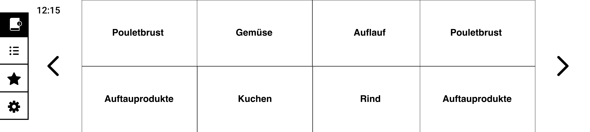
      <figcaption>Weitere Funktionen</figcaption>
    </figure>
  

#### Positives
* Die Zeitleiste hat viel Potential!
* Das Hauptmenu bietet alle «traditionellen» Funktionen und über das die Submenüs können weitere Funktionen abgefuren werden.
* Weitere Funktionen/Zugänge können über die Navigation leicht erreicht werden.
#### Inputs/Verbessern
* Temperatur als «Leiste» mit Balken von 0° bis x° ist eher schwierig (siehe)
* Ist die Führung zum starten des Ofens (Pfeil rechts) klar?
* Sind die Icons vom Submenü genügend aussagekräftig?
* Grafische Einheit müsste noch hergestellt werden (Icons, Zeit, Schriftgrössen)
* Das bestehende Denkmodel (Modi, Temperatur, Zeit) wurde nicht erweitert oder alternative Zugangsschritte gezeigt (visualisiert).
* Zeitleiste und das ablaufen der Zeit müsste noch einmal detailiert betrachtet werden. Viele Fragen sind noch offen, jedoch grosses Potential.
#### Übersicht
★★★★☆ – Technik  
★★★★☆ – Inhalt  
★★★★☆ – Interaktion/Führung  
★★★☆☆ – Konzept  

### Entwurf «Alternative»
Team Marc, Nils und Lars haben in Ihrem Entwurf zwei Zugänge zur Bedienung des Backofens gewählt und in ihrem [Konzept](https://hackmd.io/@larsmaeder/HydfvuNt4?type=view#) auch Überlegungen zu ihrer Vision festgehalten.

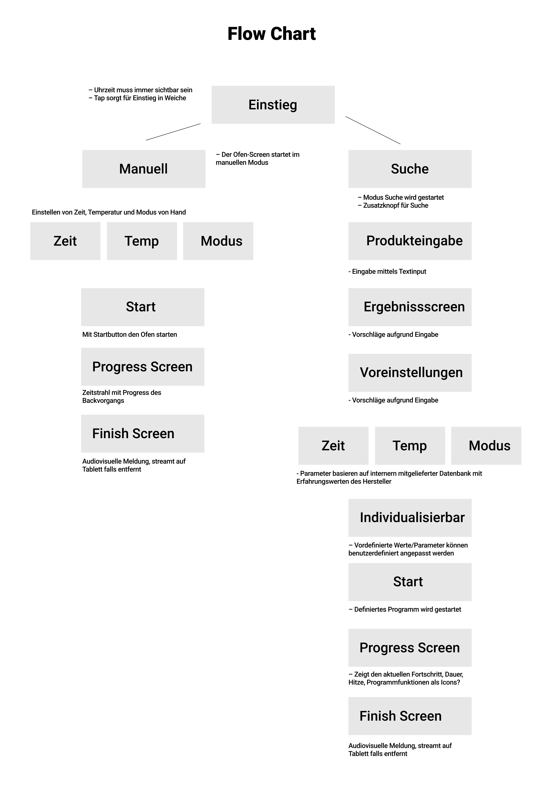

  

    <h3>Interface</h3>
  

  

    <figure class="border">
      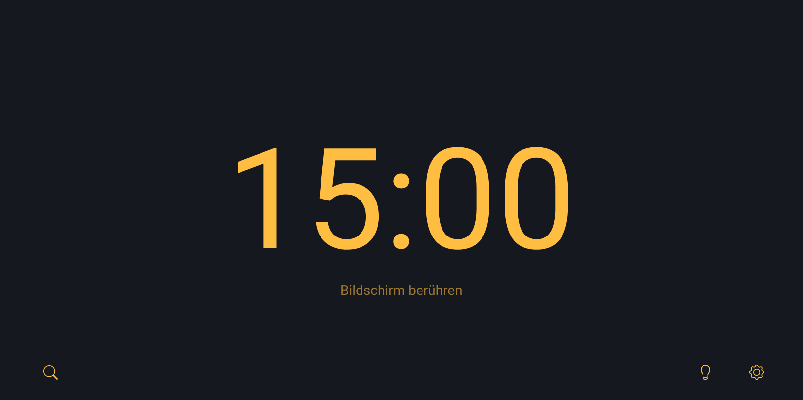
      <figcaption>Grundzustand</figcaption>
    </figure>
  

  

    <figure class="border">
      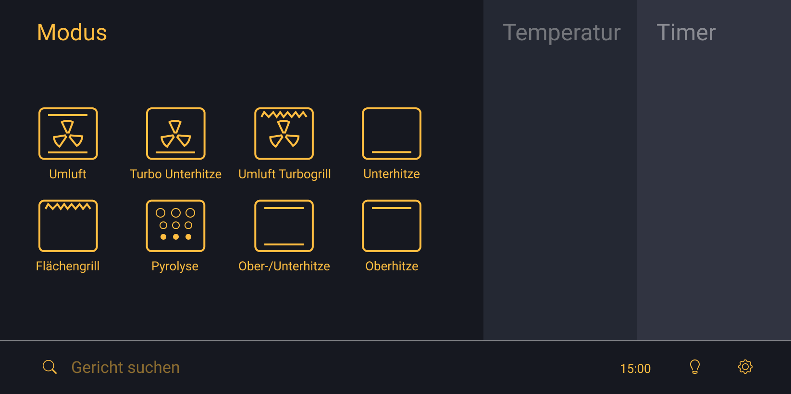
      <figcaption>Wahl des Modus</figcaption>
    </figure>
  

  

    <figure class="border">
      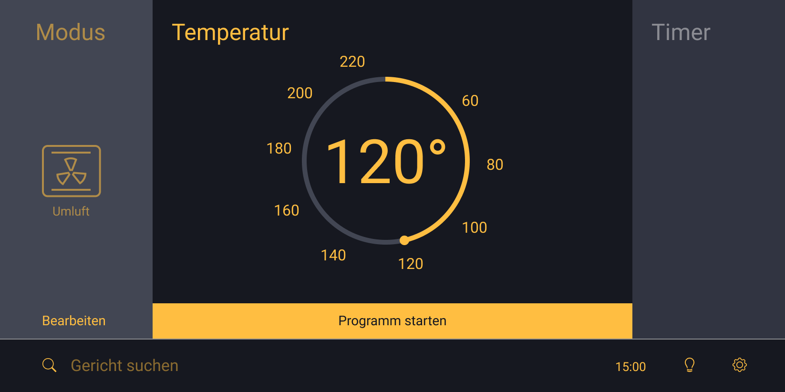
      <figcaption>Wahl der Temperatur</figcaption>
    </figure>
  

  

    <figure class="border">
      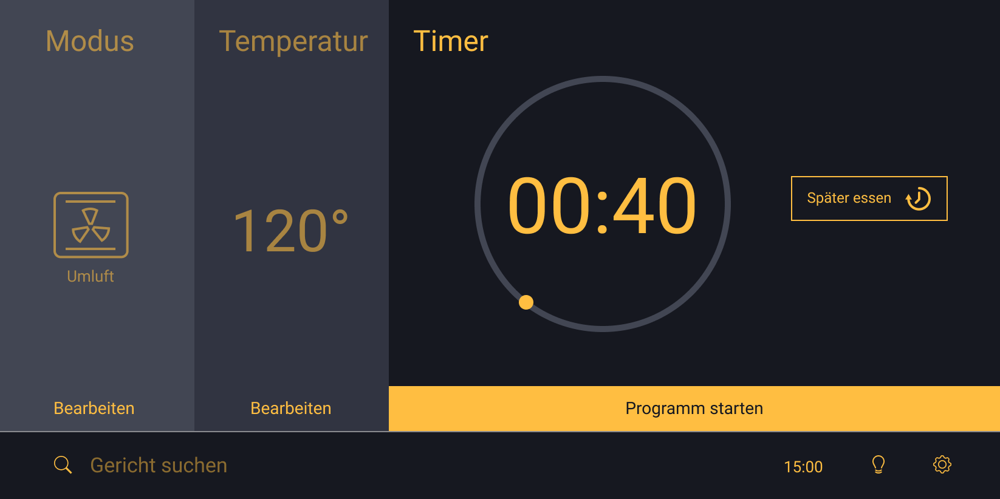
      <figcaption>Wahl der Zeit</figcaption>
    </figure>
  

  

    <figure class="border">
      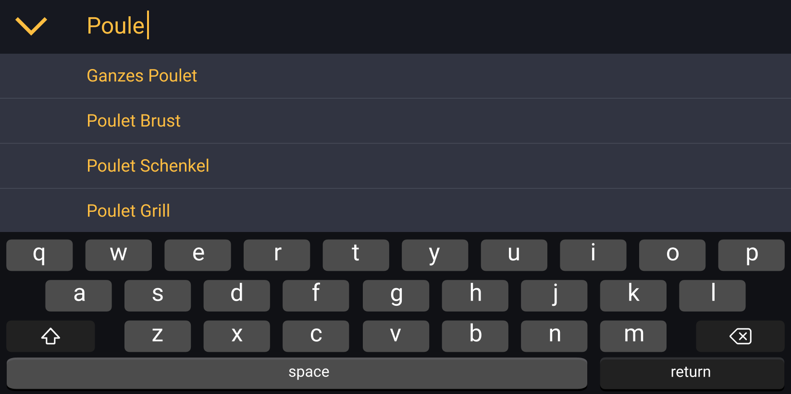
      <figcaption>Wahl nach Gericht</figcaption>
    </figure>
  

  

    <figure class="border">
      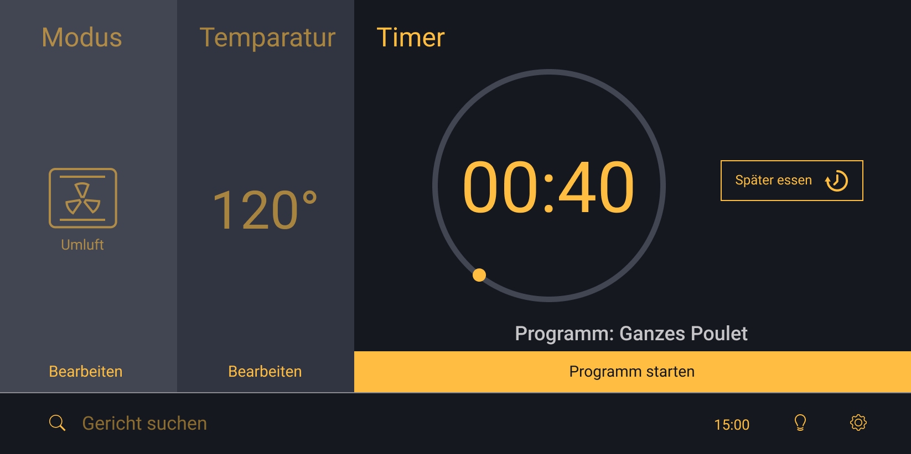
      <figcaption>Backvorschlag nach Gericht</figcaption>
    </figure>
  

  

    <figure class="border">
      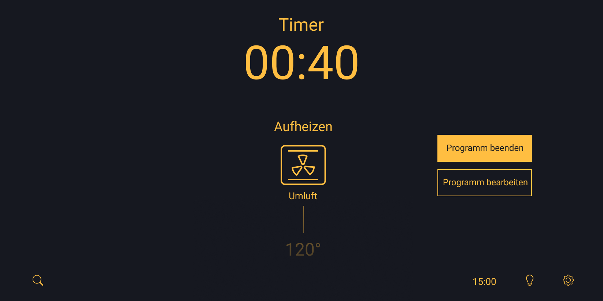
      <figcaption>Anzeige während dem Betrieb</figcaption>
    </figure>
  

  

    <figure class="border">
      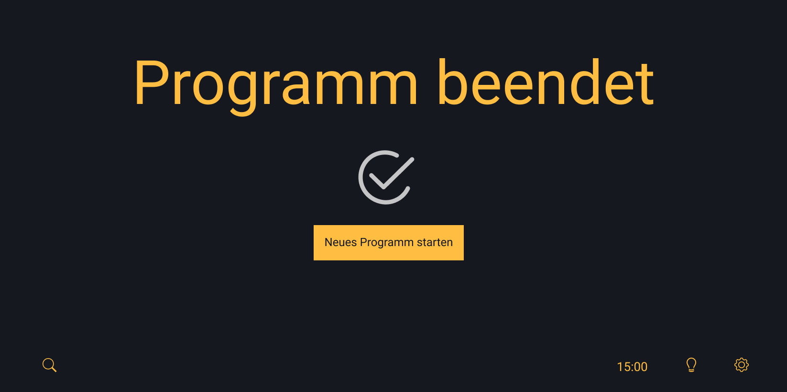
      <figcaption>🍗</figcaption>
    </figure>
  

#### Positives
* Klare grafische Sprache
* Grafische Realisation bereits weit ausgearbeitet
* Sehr simples und zugängliches Interface
* Suchfunktion mit Backvorschlag toll gelöst!

#### Inputs/Verbessern
* Grafische Sprache des Timers noch nicht klar. Bräuchte noch einen «aktiven» Bereich wie bei der Temperatur

#### Übersicht
★★★★☆ – Technik  
★★★★☆ – Inhalt  
★★★★☆ – Interaktion/Führung  
★★★★☆ – Konzept  

### Entwurf «Just-in-time»
Marius, Wolfgang und Nicole haben sich thematisch auf das Thema Zeit fokussiert und was allenfalls auch noch während des Backends entscheidend sein kann. Der Zeitstrahl kann somit nicht nur auf das Ende hin steuern, sondern es können noch weitere Reminder gesetzt werden.

  

    <h3>Interface</h3>
  

  

    <figure class="border">
      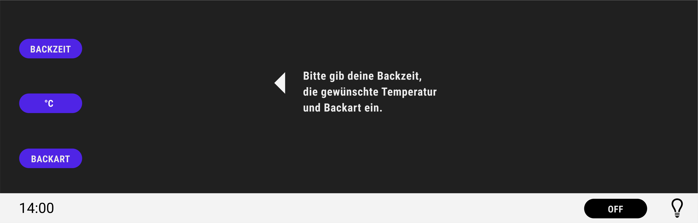
      <figcaption>Hauptmenu</figcaption>
    </figure>
  

  

    <figure class="border">
      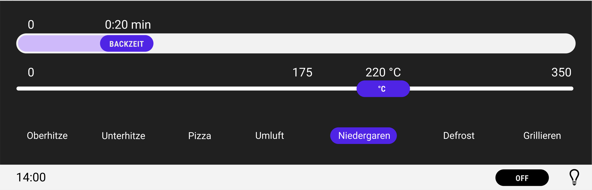
      <figcaption>Wahl der Zeit, Temperatur und Modi</figcaption>
    </figure>
  

  

    <figure class="border">
      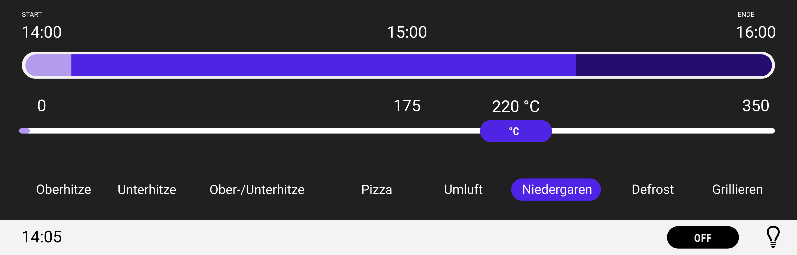
      <figcaption>Anzeige während dem Betrieb</figcaption>
    </figure>
  

  

    <figure class="border">
      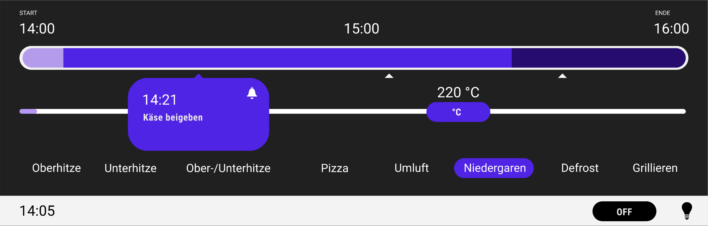
      <figcaption>Es können Marker/Reminder gesetzt werden</figcaption>
    </figure>
  

  

    <figure class="border">
      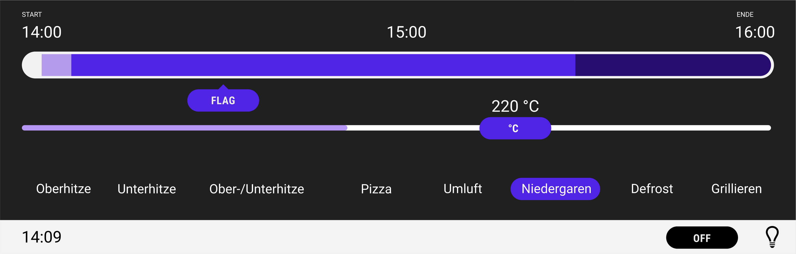
      <figcaption></figcaption>
    </figure>
  

  

    <figure class="border">
      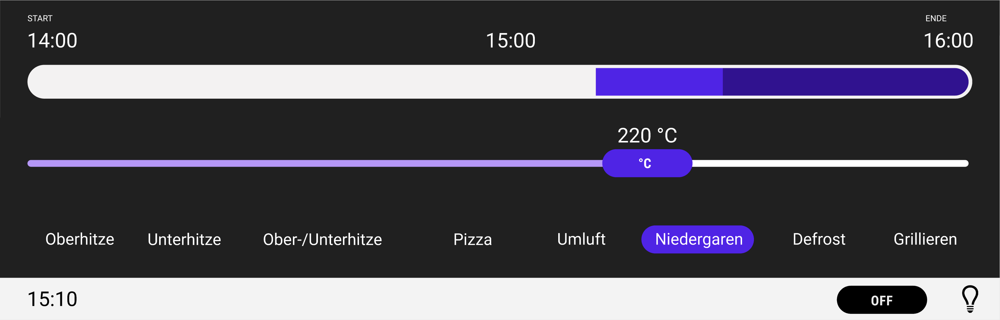
      <figcaption></figcaption>
    </figure>
  

  

    <figure class="border">
      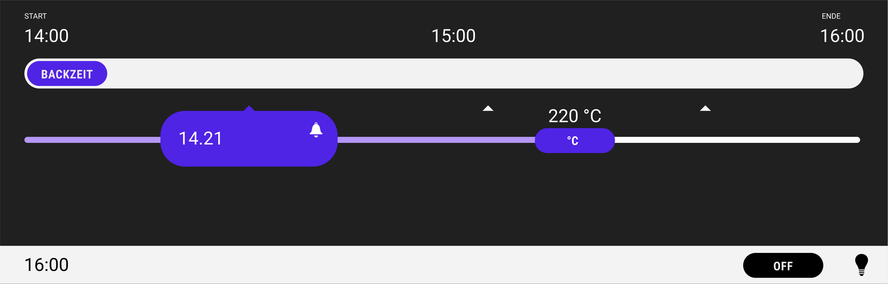
      <figcaption></figcaption>
    </figure>
  

#### Positives
* Gute Direktwahl! 🍕
* Der Zeitstrahl ist wohl ein guter Zugang im gewählten Interface.
#### Inputs/Verbessern
* Der «Start» müsste wohl noch (klarer) realisiert sein.
* Die Temperaturwahl müsste noch einmal Überdacht werden (Schritte wohl zu grob)
* Anzeige von Vorheizen, Ablauf der Zeit und Total Zeit ist visuell schwer verständlich
* Was für Marker können wie gesetzt werden? Tastatur?
* Der Zeitstrahl ändert von Dauer zu Zeit. Müsste man genauer Prüfen ob dies nicht verwirrend ist.
* Grafische Sprache müsste noch einmal gefestigt werden. Was trägt Farbe und weshalb? Zeit hat eine Farbe (nicht wählbar) Buttons/Slider haben eine Farbe, aber nicht alle (OFF-Button).
#### Übersicht
★★★☆☆ – Technik  
★★★★☆ – Inhalt  
★★★☆☆ – Interaktion/Führung  
★★★☆☆ – Konzept  

## Fazit
Für alle Beteiligten – Studierende wie Dozierende – war wohl klar, dass das Thema Küchenofen noch viel Potential zur Verbesserung bietet. Ob es eine verstellte Uhr, eine komplizierte Defrost-Funktion oder die Frage nach der richtigen Zubereitung ist; früher oder später sind wir wohl alle schon an interface und inhaltliche Probleme im Umgang mit diesem alltäglichen Küchengerät geraten. Einen Tag Case Study kann nicht alle Fragen beantworten, aber es gibt Ansätze, die man im Praxistest gerne validieren möchte!
