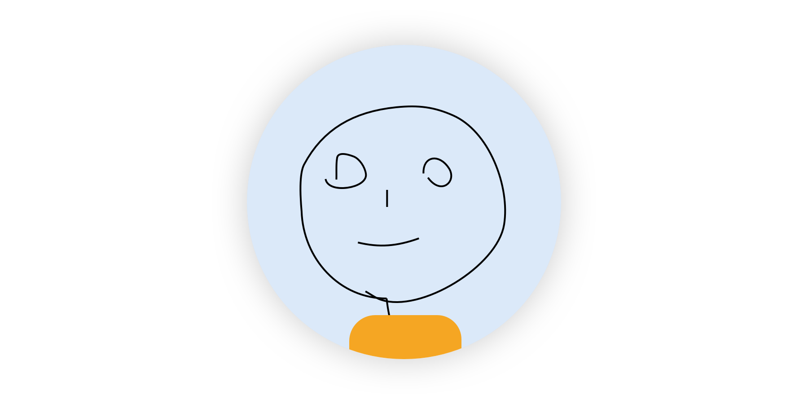
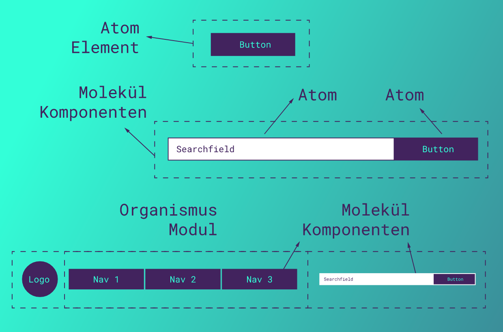
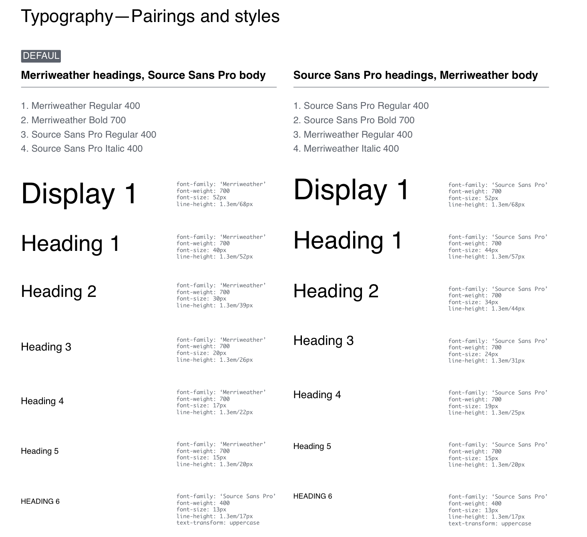
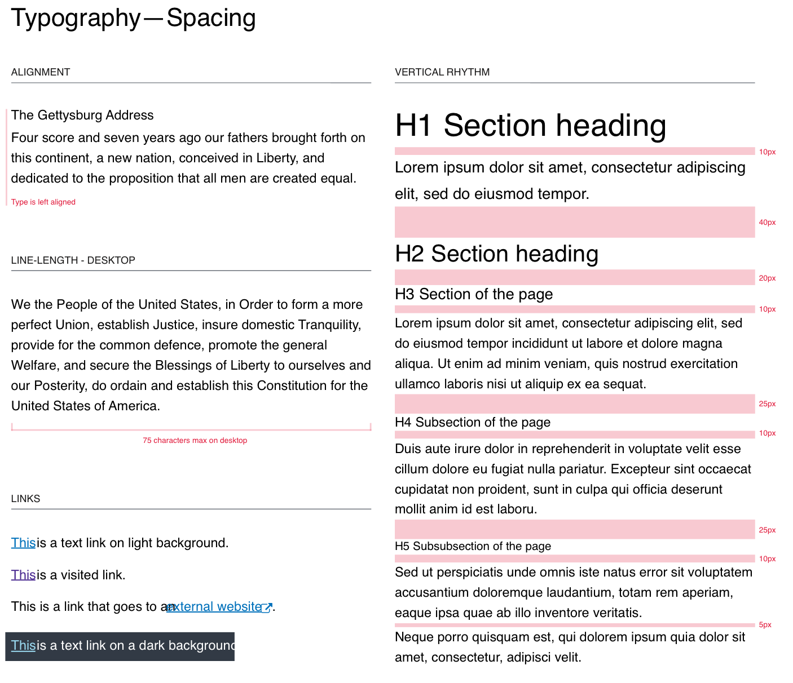
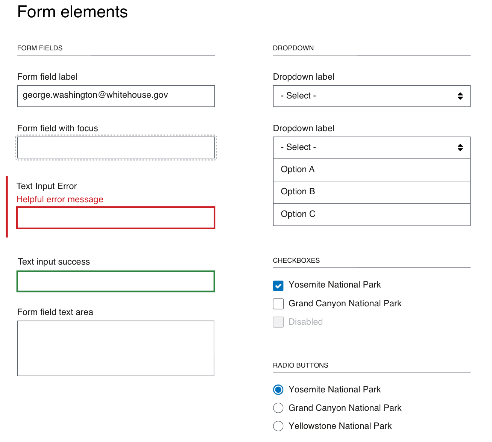
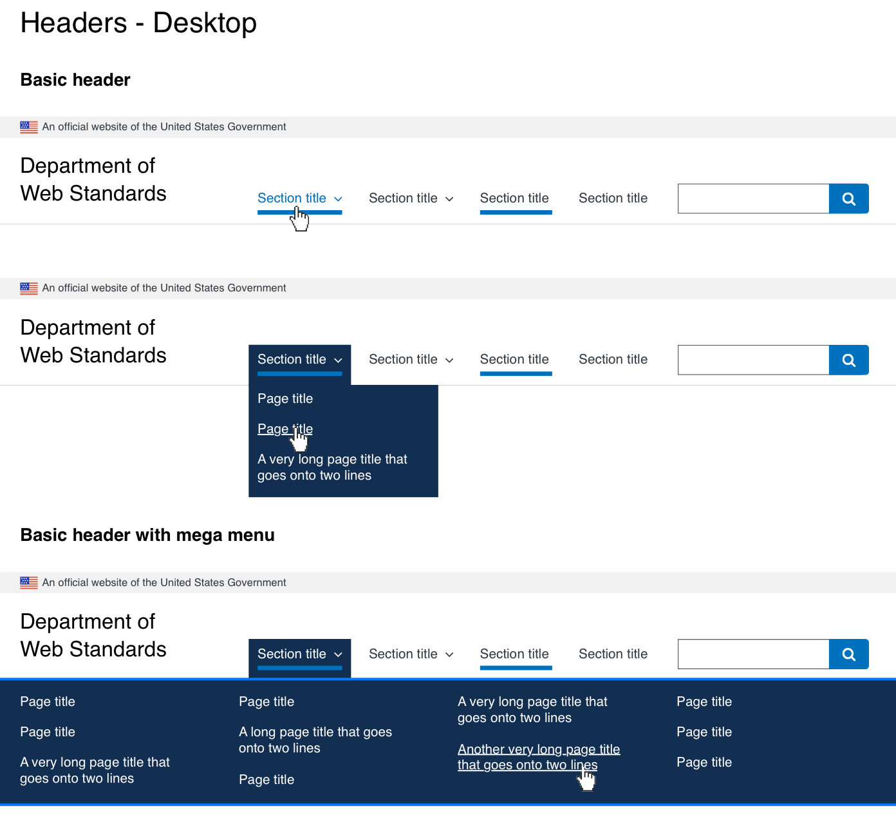

## Doch welcher Design-Übergabe-Typ bist du? Und wann ist welcher Typ im Vorteil?

Liste und Vergleich der wichtigsten Tools: [Uxtools.co | Compare UX Tools](http://uxtools.co/tools/handoff)

---

  <figure >
  	
  </figure>

## Typ 1️⃣ Der Minimalist
Der Designer übergibt den Entwicklern ein visuelles Layout und Designspezifikationen zum auslesen. Er verzichtet dabei auf einen genauen und detaillierten Beschrieb seiner Arbeit und überlässt den Entwickelnden dafür mehr Freiheit bei der Umsetzung.

### Übergabe und Tools
In diesem Beispiel wird ein Referenzdesign Desktop und oder Mobile von den Designenden gestaltet welches dann mithilfe der Tools untersucht werden kann. In dieser Form der Übergabe hat der Entwickler zwar alle Designspezifikationen jedoch keine Richtlinien wie sich Inhalt und Elemente zwischen den Referenzdesigns verhält, skaliert und wie sie sich bewegen. Einzelne Effekte und Zustände können via Kommentarfunktion definiert werden, wie dass diese umgesetzt werden ist dann den Entwicklern überlassen.

### Vor- und Nachteile
## 👍🏼
Durch den Verzicht auf die Erstellung eines detaillierten Handout wird sehr viel Zeit eingespart und somit auch Budget. Zudem sind die Gedanken ja im Kopf des Designers und können in einem Kurzen Briefing erklärt werden oder sind bei Rückfragen von der Entwicklung einfach zu beantworten.

## 👎🏼
Das Design ist weniger unter Kontrolle, da der Entwickler keinen genauen beschrieb zu jedem einzelnen Element hat sondern eher einen Gesamteindruck vermittelt bekommt.
Die umgesetzte Arbeit sollte laufend mit dem Design abgeglichen werden und auf Unstimmigkeiten geprüft werden. (Qualitätskontrolle)

### Fazit
Die minimalistische Methode der Referezdesigns und deren Übergabe an die Entwicklung eignet sich für kleinere Budgets und «in house» Entwicklungen wo gedanken auch mündlich erklärt oder gebrieft werden können, da es sonst zu viele Fragen aufwirft. Nicht zu empfehlen ist es bei grösseren Projekten oder externer Entwicklung da es sehr schnell unübersichtlich wird und nicht nachvollziehbar für den Entwickler, da diesem die Überlegungen vom Designer fehlen.

---

  <figure >
  	
  </figure>

Quelle: [freepik.com](https://de.freepik.com/)

## Typ 2️⃣ Der Hybrid

Diesem Typ von Designer ist es wichtig dass sein Design von der Entwicklung verstanden wird. Es gibt Überlegungen die hinter den Abständen und Schriftgrössen stecken. Daher wird, zusätzlich zu den gängigen Übergabe-Tools, noch ein kleiner Styleguide mitgeliefert.

### Übergabe und Tools

Die gängigen Übergabe-Tools wie InVision-Inspect, Zeplin oder XdCloud gehören beim Typ „Hybrid“ zum Standard. Darin können die Entwickler alles auslesen was benötigt wird. Die Massangaben im Referenzdesign beziehen sich oftmals auf Pixel, meistens erhält die Entwicklung ein Desktop-Viewport und ein Mobile-Viewport. Jedoch steckt dahinter ein System, dieses ist zwar nicht auf Basis von verschiedenen Formeln entstanden, jedoch gibt es fixe Abstände und Regeln die angewendet werden müssen.

Zusätzlich zu den Inspect-Tools wird daher kurzerhand ein kleiner Styleguide geschrieben. Darin sind die Abstände, Farben, Schriften und eventuell sogar einige Zustände abgebildet. Dies bedeutet zwar einen kleinen Mehraufwand, dieser wird doch sehr gerne in Kauf genommen.

### Vor- und Nachteile
## 👍🏼
Ein Vorteil dieser Arbeitsweise ist das Abfangen diverser grundlegenden Fragen. Der kleine Styleguide erklärt schon an einigen expliziten Beispielen die Logik und gibt Einblick in die Gedankengänge. Der Styleguide dient hierbei vielmehr als Diskussionsgrundlage und Orientierung für eventuelle Fragen und Abklärungen.

## 👎🏼

Das Problem ist aber die skalierbarkeit, in einem so kleinen Styleguide können niemals alle Fälle auf jedem Viewport oder Device abgebildet werden. Dies würde einen immensen Mehraufwand verursachen. Die einzige Lösung für diesen Fall wäre, ein dem ganzen Design zugrundeliegendes Designsystem, welches auf alle Grössen und Viewports beliebig skaliert werden kann.

So wird es trotz kleinem Styleguide immer wieder Rückfragen von der Entwicklung geben. Was grundsätzlich kein Problem ist.

### Fazit

Für welche Projekte eignet sich diese Arbeitsweise? Optimal ist diese Arbeitsweise bei eher kleineren bis mittleren Projekten. Es kann nicht extrem viel Zeit für einen sehr detaillierten Styleguide für die Übergabe aufgewendet werden. Da die Entwicklung aber meistens nicht in-house ist, macht es Sinn die grundsätzlichen Überlegungen zu transferieren.

Diese Arbeitsweise erfordert natürlich noch immer die enge Zusammenarbeit mit der Entwicklung, jedoch haben beide Parteien eine Diskussionsgrundlage mit dem Referenz-Design und dem Styleguide.

---

  <figure >
  	
  </figure>

Quelle: [zappos.com](https://www.zappos.com/)

## Typ 3️⃣ Mit System
Der Styleguide wird übergeben. Das Design wird in einem UI Kit aufgebaut und die einzelnen Elemente bis auf Atome heruntergebrochen und einzeln definiert. Es wird übergreifend mit einer Einheit gearbeitet. Die gängigsten Screens werden vorbereitet und so den Entwicklern übergeben. Transitions werden zusätzlich als Animation aufbereitet. Die Umsetzung und Wahl der Einheiten wird den Entwicklern überlassen.

### Übergabe und Tools
#### Aufbau
Der IAD baut das Design in einem UX-Tool auf. Er beginnt mit dem gängigsten Screen und definiert dafür die einzelnen Elemente –  vorzugsweise in Pixel. Alle weiteren Screengrössen werden dann davon abgeleitet und die Elemente angepasst. Neben den Gängigen Elementen wie Buttons, Fontgrössen, etc. werden auch Abstände und Platzhalter definiert und in Variablen umgewandelt.

##### Methoden
**Atomic Design & Modulare Komponenten**

  <figure >
  	
  </figure>

Quelle: [Webdesign-Essentials](https://www.webdesign-essentials.ch/kategorien/anatomie-einer-webseite)

Mehr über Atomic Design & modulare Komponenten

Das Design kann vom Atom bis auf komplette Seiten auf- und abgebaut werden. Je nach Agentur werden diese unterschiedlich benannt, meinen aber oft dasselbe. So kann ein Atom auch ein Element oder ein Molekül eine Komponente sein. Egal welche Methode man also wählt, beide haben dieselbe Struktur und ergeben einen ähnlichen Aufbau.

---

**Pattern Libraries**

  <figure >
  	
  </figure>

Quelle: [Carbon Design System](https://www.dropbox.com/s/fqsbl6vbqeteg1h/Screenshot%202019-06-07%2011.41.59.png?dl=0!
)

Mehr über Pattern Libraries

Bei den Pattern Libraries werden die gängigen Elemente wie Buttons, Header, Slider, Navigation, etc. und deren Verhalten definiert. Jede Website besteht aus einem Grundgerüst welches oft aus denselben Elementen besteht. Es lohnt sich für jeden IAD sich vor Beginn über den Aufbau der Website oder App Gedanken zu machen um die dazugehörige Bibliothek erstellen zu können.

---

#### Designtools
Für die Übergabe wird der UI Kit und die Mockups/Prototypes exportiert. Der Link wird an die Entwickler weitergegeben. Durch den Export werden die Spezifikationen aller Elemente und Screengrössen angezeigt und können so ganz einfach ausgelesen, kopiert und heruntergeladen werden.
Wie sich die Referenzdesigns genau verhalten ist in den Spezifikationen ersichtlich. Diese werden von den Ingenieuren in Zusammenarbeit mit den IADs geschrieben und den Entwicklern als separates Dokument geliefert.

#### Styleguide & Wiki
Einen (bereits vorhandenen) Styleguide mitgegeben, welcher die wichtigsten Infos enthält. Dieser soll den Entwicklern erste grobe Informationen liefern. Die meisten Projektmanagementsoftwares wie [Confluence](https://de.atlassian.com/software/confluence) oder [Azure DevOps](https://azure.microsoft.com/en-us/services/devops/?nav=min) bieten ein integriertes Wiki an, wo Fragen/Themen beantwortet werden können.

#### Transitions
Transitions werden in Tools wie [Principle](https://principleformac.com/), [Flinto](https://www.flinto.com/), [Adobe After Effects](https://www.adobe.com/ch_de/products/aftereffects.html), etc. aufbereitet und zusätzlich zum UI Kit weitergegeben. Ein erklärendes Video ist mehr Wert, als ein paar Zeilen Text.

##### UI Kit detailliert

  <figure >
  	
    
    
    

  </figure>

### Vor- und Nachteile
## 👍🏼
Die Vorteile dieser präzisen Arbeitsweise ist, dass nahezu alles definiert und bedacht werden musste. Sobald ein Element oder eine Variable definiert ist, vereinfacht es die Kommunikation zwischen Designer und Entwickler, da beide vom Selben sprechen.

## 👎🏼
Es erfordert einen enormen Arbeitsaufwand, sehr viel Denkarbeit (um nichts zu vergessen) und eine exakte Arbeitsweise. Allem voran aber benötigt der IAD das Wissen, mit was er es zu tun hat. Die Hardware und das Ziel muss klar definiert sein, damit die Arbeit nicht umsonst ist, bzw. nur einmal gemacht werden muss.

### Fazit
Mehrere Referenzdesigns mit System aufzubauen lohnt sich bei grossen Projekten mit vielen Beteiligten. Sobald man nicht in der Lage ist, schnell etwas zu erklären oder das Team nicht im selben Raum sitzt, müssen Gedanken und Prozesse genau definiert werden damit diese jederzeit für jedermann zugänglich sind.

---
## 👑 Best Practice
### #1 | Up To You
Das Best Practice Modell ist vom jeweiligen Projekt abhängig. Der IAD muss wissen mit welchen Methoden gearbeitet wird und welches Level an Können/Wissen auf Seiten der Entwickler vorhanden ist. Anhand dieses Vorwissens entscheidet er, mit welcher Genauigkeit er die Daten aufbereitet und übergibt um zum Bestmöglichen Resultat zu kommen.

### #2 | Die Sprachen
Unabhängig davon welcher Designtyp man ist oder sein muss ist es wichtig, einen Draht zu den Entwicklern aufzubauen. Je besser man sich kennt, desto eher können Missverständnisse vermieden werden. Die Sprache eines Programmierers ist nicht gleich der eines Designers. So kann ein Wort auf etwas unterschiedliches hinweisen oder bedeuten.
