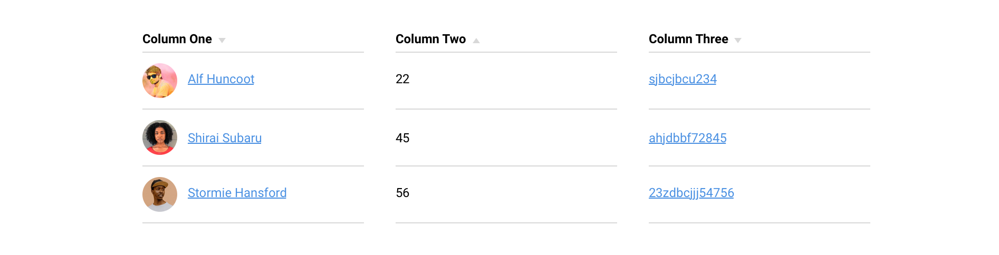
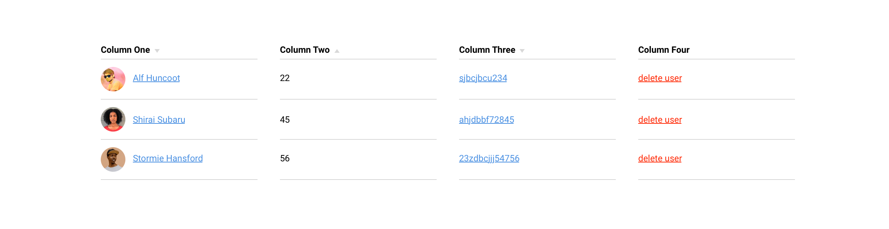
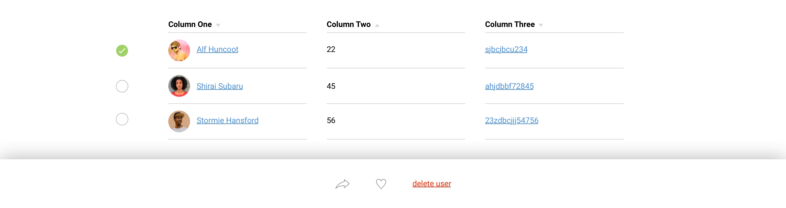
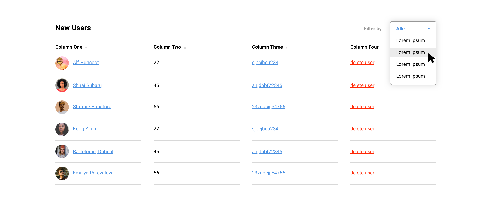
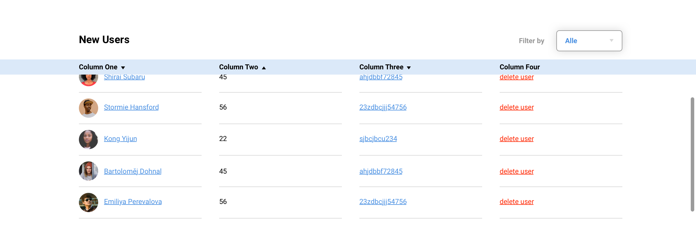
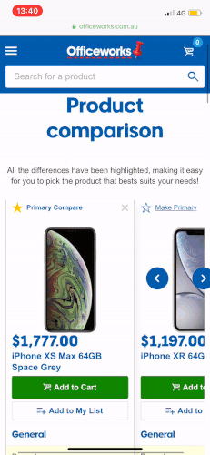
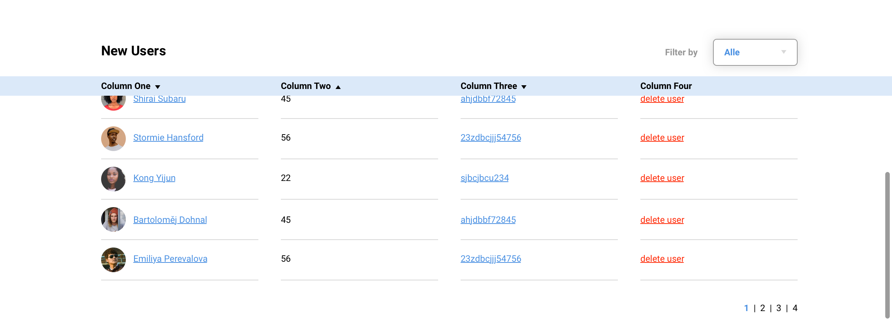
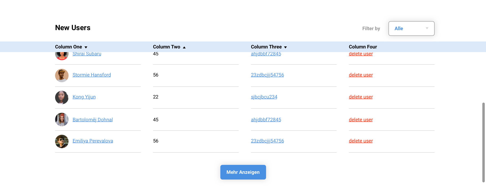
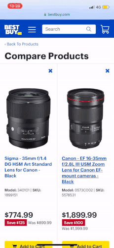

Mit Tabellen und Datensätzen interagieren wurde fast schon zu einem Standard und gewöhnliche starre Tabellen gehören der Vergangenheit an. Funktionen wie «Sortieren», «Filtern» und «Löschen» sind keine aussergewöhnliche Features im Web, sondern gehören zum Alltäglichen Gebrauch. Dieser neue Umgang mit Tabellen, sowie die Entwicklung von Endgeräten und wie wir das Internet konsumieren, bringt zu den bereits bekannten älteren Schwierigkeiten, eine neue Herausforderung hervor. Wie gehe ich mit Tabellen im Responsive Design um?

Nachfolgender Artikel geht auf die Grundstruktur von Tabellen ein, zeigt dabei einen kleinen Ausschnitt an Möglichkeiten von Interaktionen mit Tabellen und versucht Lösungen für Mobilgeräte aufzuzeigen.

## Table-Based Layout Is The Next Big Thing

Tabellen als Grid von Webseiten? Bitte nicht! 🙅‍♀️

Was im Jahr 2008 der Normalität angehörte, ist heute wahrscheinlich die Hölle für jeden Frontend-Entwickler. Flexbox, CSS-Grids oder die CSS-Float-Property war dazumals noch Zukunftsmusik.

### The ~~good~~ ol' Web

Wer das Vergnügen hatte das Web seit den Anfängen zu begleiten, wird sich gut an die visuellen Auftritte der Webseiten erinnern können. Aber auch für jene, welche die technische und visuelle Entwicklung von Webseiten nicht gängig sind, erkennen schnell die typischen Merkmale von Table-Based Layouts.

#### Ecken, Kanten und noch mehr Kästen.

Tabellen wurden grundsätzlich nicht nur für das Abbilden von Daten in vertikalen Spalten und horizontalen Zeilen gebraucht, sondern auch für den Aufbau eines Grids oder Grundgerüst der Webseite. Tabellen haben neben Vorteile auch einige Tücken und Macken, im Gebrauch als Grid sind sie gegenüber den heutigen Systeme in der Funktionalität und Möglichkeiten beträchtlich eingeschränkt.

Ausserdem bietet die technisch erzwungene «Kasten»-Anordnung der verschiedenen Elemente, keine grossen flexibilität innerhalb des Layouts. So sahen Webseiten zueinander meist sehr ähnlich.

##### Das sah dann meistens so aus … 💩

<iframe height="500" style="width: 100%;" scrolling="no" title="Table Based Website" src="//codepen.io/larsmaeder/embed/arwjqp/?height=265&theme-id=light&default-tab=result" frameborder="no" allowtransparency="true" allowfullscreen="true">
  See the Pen <a href='https://codepen.io/larsmaeder/pen/arwjqp/'>Table Based Website</a> by Lars Mäder
  (<a href='https://codepen.io/larsmaeder'>@larsmaeder</a>) on <a href='https://codepen.io'>CodePen</a>.
</iframe>

### Aufbau und Attribute

Ich möchte nicht zu tief in die technische Merkmale der Tabellen eintauchen, sondern nur an der Oberfläche kratzen um ein gewisses Grundverständniss zu übermittel. Dies ist nötig um spätere Probleme schneller zu erkennen und dafür Lösungsansätze zu finden.

Das `<table>`-Element in HTML wird zum Anzeigen von Tabellendaten verwendet. Eine Kopfzeile wird mit `<thead>` gekennzeichnet. Die gesamte erste Zeile enthält daher keine Daten, sondern lediglich die Titel der Spalten. `tr` kennzeichnet Tabellenzeilen und `td` Tabellendaten. Im Wesentlichen besteht eine Tabelle aus Spalten und Zeilen.

##### Aufbau einer einfache Tabelle:

<iframe height="265" style="width: 100%;" scrolling="no" title="Simple Table" src="//codepen.io/larsmaeder/embed/YbQJYW/?height=265&theme-id=light&default-tab=html,result" frameborder="no" allowtransparency="true" allowfullscreen="true">
  See the Pen <a href='https://codepen.io/larsmaeder/pen/YbQJYW/'>Simple Table</a> by Lars Mäder
  (<a href='https://codepen.io/larsmaeder'>@larsmaeder</a>) on <a href='https://codepen.io'>CodePen</a>.
</iframe>

## Responsive Design und Tabellen

Tabellen dienen im Web nicht nur der Visualisierung von Datensätzen, sie ermöglichen dem User auch das Arbeiten mit Informationen. Dies kann mittels diversen Interaktions-Möglichkeiten dem User vereinfacht werden. Folgende Methoden eignen sich besonders gut, um dem User Datensätze in einer Tabelle zugänglicher zu machen.

Das Ziel ist Tabellen auf allen Engeräten gleich auszugeben, egal ob Desktop- oder Mobilbildschirm. Dabei versuchen wir unsere Gestaltung und Umgang mit Tabellen nach den Designprinzipien von Don Norman anzulehnen. Besonders drei davon sollten wir uns immer im Hinterkopf behalten. Sinngemäss zusammengefasst wären diese folgende:

1. Spalten von links nachs rechts nach ihrer Wichtigkeit anordnen
2. Wesentliches ersichtlich machen. Den Kontext bewahren auch wenn zusätzliche Details angezeigt werden
3. Sprich menschlich, klar und für jedermann verständlich

### Links innerhalb von Tabellen

Links innerhalb von Tabellen können schnell zusätzliche Hintergrundinformationen vermitteln.

> **Wichtig** 
> Dem User muss jederzeit klar sein was der Link für eine Aktion ausführt.

Unklare und verwirrende Links sollten vermieden werden. Zusätzlich ist es besser wenn Links immer in einem neuen Tab geöffnet werden, der User soll nicht aus der aktuellen Auseinandersetzung mit der Tabelle gerissen werden.

#### Beispiel:

    <figure>
        
    </figure>

Hier sehen wir in der ersten Spalte verschiedene Benutzer. Dem User versteht aus dem Kontext, dass der Link sehr wahrscheinlich das jeweilige Benutzerprofil öffnet. Hingegen in der letzten Spalte wird dem User nicht klar sein, wohin der Link führt oder welche Aktion bei einem Klick ausgeführt wird.

### Aktionen innerhalb von Tabellen

Dem User werden oftmals schon innerhalb der Tabellen diverse Möglichkeiten zur Interaktion geboten. «Teilen», «Drucken», «Löschen» und «Favorisieren» sind die gängigsten Aktionen die dem User zur Verfügung stehen. Diese Aktionen können innerhalb einer Zeile direkt untergebracht werden.

#### Beispiel:

    <figure>
        
    </figure>

In diesem Beispiel wurde die Funktion «User löschen»/«delte user» direkt in die jeweilige Zeile eingebettet. Aktionen auf diese Art und Weise sind weit verbreitet und werden von Usern schnell verstanden.

Jedoch gibt es hier auch einige Punkte die nicht ausser Acht gelassen werden sollten und für Mobilgeräte Probleme bereiten können:

- Wir fügen der Tabelle eine zusätzliche Spalte hinzu
- Die Aktion kann nicht über mehrere Zeilen angewendet werden
- Die Spalte wirkt für den User redundant

Eine einfache Lösung für diese Probleme kann die Multi-Selection-Funktion sein.

### Multi-Selection

Mittels Multi-Selection können Tabellen aufgeräumt werden, die Aktion wird von der Tabelle getrennt und es wird keine zusätzliche Spalte benötigt. Der User selber entscheidet, wann die Aktion sichtbar wird und wann nicht. Auch ein arbeiten über mehrere Zeilen gleichzeitig hinweg ist so gewährleistet.

#### Beispiel:

    <figure>
        
    </figure>

### Filter Funktion

Filter ermöglichen es dem User gezielt Daten innerhalb eines grossen Datensatzes zu finden.

> **Wichtig** 
> Hierbei ist zu beachten die Filterfunktion möglichst einfach zugänglich zu machen. Und noch wichtiger ist es, dem User zu ermöglichen, die Filterfunktion wieder einfach zu entfernen.

#### Beispiel:

    <figure>
        
    </figure>

### Sticky Header oder Spalten

Sticky Elemente helfen bei einer guten Übersichtlichkeit und helfen dem User den Überblick zu bewahren. Die unterschiedlichen Zeilen können so optimal miteinander verglichen werden. Dies kann horizontal mittels einem fixierten Header (im Beispiel Blau eingefärbt), oder vertikal mit einer fixierten Spalte ermöglicht werden.

#### Beispiel Sticky Header:

    <figure>
        
    </figure>

#### Beispiel Sticky Spalte:

    <figure>
        
    </figure>

Quelle: [Officeworks](https://www.officeworks.com.au/)

> **Wichtig** 
> In diesem Beispiel schlecht umgsetzt ist die Spaltenbreite. Diese sollten nicht zu breit sein, da es sonst schnell unleserlich wird auf Mobilgeräten.

### Mehr Zeilen oder Seiten

Manchmal hilft es dem User die Informationen häppchenweise zu präsentieren. Müssen nicht zwingend alle Zeilen miteinander verglichen werden, ist eine Unterteilung auf mehrere Seiten eine gute Lösung.

    <figure>
        
    </figure>

Eine weitere Möglichkeit wäre auch ein Infinite Scroll bzw. Lazy Loading des Inhalts. Diese Funktion kann unterstützend mit einem «Mehr» Button kombiniert werden.

    <figure>
        
    </figure>

> **Wichtig** 
> Bei beiden Varianten sollte immer darauf geachtet werden, dass die wichtigen Informationen auf dem ersten Viewport ersichtlich sind. Dem User soll dabei die Möglichkeit immer selbst überlassen werden, sich fürs Anzeigen von mehr Informationen zu entscheidet.\*\*

#### Horizontales & vertikales scrollen

Möchte man auf dem Desktop mehrere Produktespalten miteinander vergleichen und dabei aber eine endlose breite Tabelle verhindern, lässt sich diese über eine fixe Tabellenbreite und mittels vertikal scrollen umsetzen.

Horizontales scrollen bleibt auf Desktop sowies Mobil gewährleistet. Eine zusätzliche Unterstützung der Übersichtlichkeit wird mittels einzelnen fixierten Tabellenzeilen ergänzt.

    <figure>
        
    </figure>

Quelle: [Best Buy](https://www.bestbuy.com/site/compare?skus=1899151,5578531,5100207,2823760,4671800,7163669,7089386,1368051&url=%2Fsite%2Fsearchpage.jsp%3F_dyncharset%3DUTF-8%26ks%3D960%26sc%3DGlobal%26list%3Dy%26usc%3DAll%2BCategories%26type%3Dpage%26id%3Dpcat17071%26iht%3Dn%26seeAll%3D%26cp%3D1%26browsedCategory%3Dpcmcat171900050007%26st%3Dcategoryid%2524abcat0410018%26qp%3D%255Elensmountcompatibility_facet%253DLens%2520Mount%2520Compatibility~Canon%2520EF)

### Verschiedene Endgeräte – verschiedene Tabellen

Manchmal ist es jedoch nicht immer möglich eine Tabelle auf allen Endgeräten gleich darzustellen. Im unteren Beispiel sehen wir auf Desktop eine klassischen Tabelle, welche Informationene nebeneinander darstellt. Auf schmalen Mobilgeräten stossen wir mit breiten Tabellen schnell an unsere Grenzen.

So wird auf Mobile ein anderes Layout gewählt. Die klassische Tabelle wird ausgeblendet und die Informationen werden in einer anderen Form wiedergegeben.

> **Wichtig** 
> Auch wenn auf Mobile ein anderes Layout gewählt wird. Es sollte auf keinen Fall unterschiedliche Inhalte auf den Endgeräten angezeigt werden. Beide Layout müssen die gleichen Funtionen abdecken.

#### Beispiel:

    <figure>
        
    </figure>

#### Beispiel:

    <figure>
        
    </figure>

## Fazit

Tabellen bleiben im Responsiven Webdesign eine Herausforderung. Manchmal hilft es sich vom Gedanken, auf jedem Device 1:1 die gleiche Tabelle abzubilden, zu lösen. Oftmals ist eine Tabelle auf Mobilgeräten nicht die beste Lösung und eine Layoutvariante mit einer kurzen Zusammenfassung der Informationen eignen sich beispielsweise besser.
