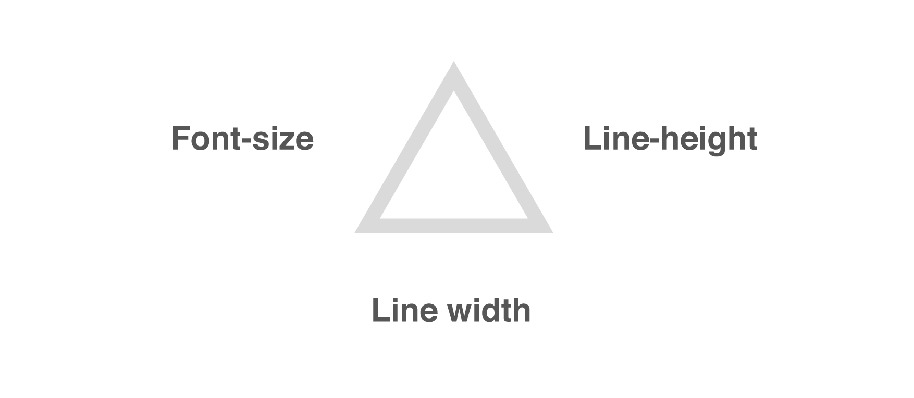

<div>
  <figure >
  	
        <p style="text-align:left; font-size:40%;">© Wolfgang Schoeck</p>
  </figure>
</div>

Bei einem gleichseitigen Dreieck sind alle drei Innenwinkel zueinander kongruent und betragen jeweils 60°. Damit ist ein gleichseitiges Dreieck eine gute Darstellung für drei Dinge, die sich in perfektem Gleichgewicht befinden. Im Bezug auf Typografie verdeutlicht die Darstellung oben, dass das Zusammenspiel der Schriftgrösse, des Zeilenabstands sowie der Spaltenbreite ausschlaggebend für einen ausgewogenen Satz ist.

Mehr zum perfekten Dreieck gibt es [**hier**](https://css-tricks.com/equilateral-triangle-perfect-paragraph/)

## Silbentrennung

Die Silbentrennung kann im Browser mit der hyphen-Klasse beeinflusst werden. Dabei gibt es drei Möglichkeiten diese im CSS festzulegen:

```css

p {
  hyphens: none | manual | auto
}

```

Zusätzlich dazu ist es möglich, mittels &amp;shy: selber zu bestimmen, an welcher Stelle ein Wort umbrechen soll. Verdeutlicht wird dies im Code-Beispiel unten anhand der beiden Headlines, bei denen einmal mit &amp;shy: genau definiert ist, an welcher Stelle im Wort getrennt werden soll, sowie anhand der zweiten Headline, bei welcher hyphens: auto zugeordnet ist. Ausserdem kann vor oder nach einem Wort auch mittels dem break-tag ein harter Umbruch erzwungen werden.


<iframe height="265" style="width: 100%;" scrolling="no" title="hyphens" src="//codepen.io/wschoeck/embed/vwqpQY/?height=265&theme-id=0&default-tab=html,result" frameborder="no" allowtransparency="true" allowfullscreen="true">
  See the Pen <a href='https://codepen.io/wschoeck/pen/vwqpQY/'>hyphens</a> by wschoeck
  (<a href='https://codepen.io/wschoeck'>@wschoeck</a>) on <a href='https://codepen.io'>CodePen</a>.
</iframe>

## Grösse

Es gibt verschiedene Möglichkeiten die Schriftgrösse zu definieren. Entweder kann diese in em, rem oder auch pixeln angegeben werden. Um eine optimale Schriftgrösse in einem responsiven Layout zu erhalten macht es Sinn die Typografie mit einem relativen Wert zu definieren, also entweder em oder aber rem. Letzteres bezieht sich auf die im body definierte Schriftgrösse und eignet sich gut, um die unterschiedlichen Grössen an einer Stelle im Code anzupassen.

Die aktuelle Schriftgrösse kann dann entweder dynamisch mit calc oder aber anhand von breakpoints angegeben werden.

<iframe height="265" style="width: 100%;" scrolling="no" title="calc" src="//codepen.io/wschoeck/embed/MdGezE/?height=265&theme-id=0&default-tab=html,result" frameborder="no" allowtransparency="true" allowfullscreen="true">
  See the Pen <a href='https://codepen.io/wschoeck/pen/MdGezE/'>calc</a> by wschoeck
  (<a href='https://codepen.io/wschoeck'>@wschoeck</a>) on <a href='https://codepen.io'>CodePen</a>.
</iframe>

## Zeilenabstand

Wenn sich die Screengrösse und somit auch die Schriftgrösse ändert, muss natürlich auch der Zeilenabstand berücksichtigt werden. Sinnvoll ist daher, diesen ebenfalls in einer relativen Grösse (z. B. mit rem oder in Prozent anzugeben), damit sich dieser mit der Schriftgrösse mitskaliert.

Mehr zum Zeilenabstand im CSS gibt es [hier](https://www.mediaevent.de/css/line-height.html)

## Spalten

Während sich die Schriftgrösse und der Zeilenabstand sowohl auf die Breite wie auch die Höhe eines Layouts beziehen, hat die Spaltenbtreite in erster Linie mit der Breite eines Screens zu tun. Obwohl sich der Spaltenraster bis zu einem gewissen Grad in der Breite auch dynamisch skaliert macht es hier oft Sinn anstelle der Spaltenbreite die Anzahl der Spalten je nach Screengrösse zu ändern.

Überlegungen zur optimalen Spaltenbreite gibt es [hier](https://www.typolexikon.de/satzbreite/)

## Fazit

Neben der richtigen Schriftwahl, der Laufweite und vielen weiteren Punkten ist für gute Typografie auch das Verhältnis zwischen Schriftgrösse, Zeilenabstand sowie der Spaltenbreite entscheidend. Um bei der digitalen Anwendung von Schrift auf alle möglichen Device-Grössen einzugehen ist es von Vorteil, diese drei Werte in relativen Grössen zu definiert. Trotz oder gerade wegen den dynamischen Inhalten sollte man aber Versuchen möglichst viele Anwendungsfälle bei der Gestaltung des Satzes bereits zu berücksichtigen und diese mit Tricks und Kniffs bei der Programmierung einzukalkulieren.
