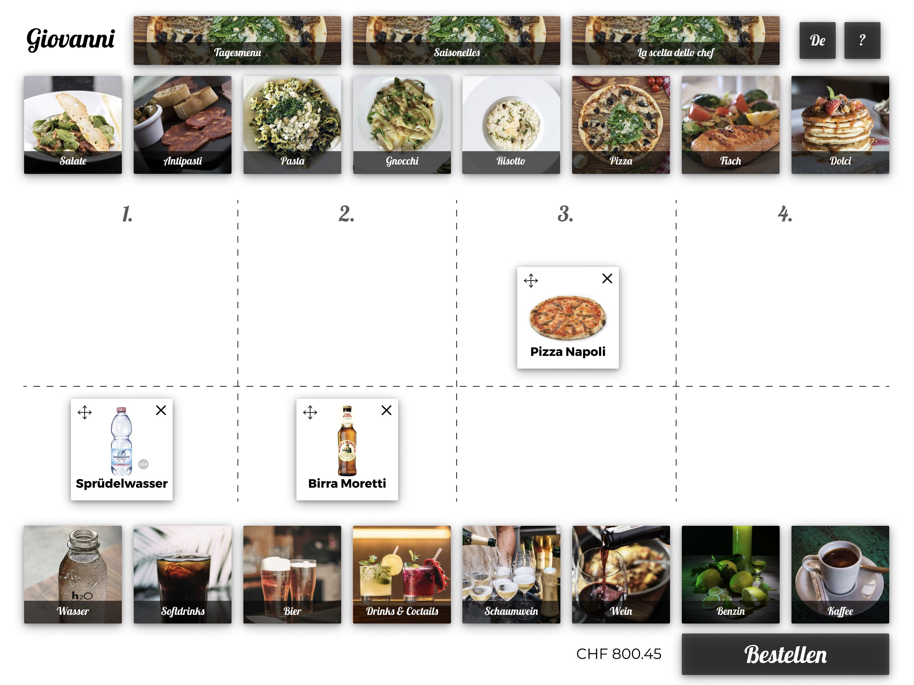

## Intro
Zum ersten Mal seit beginn des HF Interaction Designs in Zürich wurde eine Case Study mit zwei Klassen durchgeführt. Die bereits erfahreneren Studierenden im 5. Semester haben im Team mit Personen aus dem ersten Semester während einem Tag zusammengearbeitet.  
Die Klasse hatte die Aufgabe, für ein italienisches Restaurant in Zürich das künftige Bestellsystem zu entwickeln. Die Besucher sollten künftig in der Lage sein, ohne Personal und leicht verständlich, vor Ort die Bestellung zu tätigen und die Mahlzeit wird im Restaurant serviert.  
Es soll also nach wie vor Angestellte im Service geben, jedoch sollen diese eher in einer beratenden Tätigkeit agieren und für die Bestellung ist kein Personal am Tisch mehr nötig.

  

    <h3>Entwicklung</h3>
  

  

    <figure class="border">
      
      <figcaption>&nbsp;</figcaption>
    </figure>
  

  

    <figure class="border">
      
      <figcaption>&nbsp;</figcaption>
    </figure>
  

## Ausgangslage und Konzept
In der Schweiz gibt es relativ wenige Anbieter von Selbstbedienungsrestaurants, die vor Ort technische Hilfsmittel einsetzen. So hat zum Beispiel McDonalds vor Jahren ein Terminal eingeführt um essen zu bestellen, aber auch kleinere Unternehmen wie zum Beispiel die Kaffeekaus-Kette [Spettacolo](https://spettacolo.ch/) ermöglichen über eine App direkt den Kaffee zu bestellen und beim Barista ab zu holen ohne in der Schlange an zu stehen.

## Skizzen & Zwischenpräsentation

In einem ersten Schritt haben sich die Gruppen gedanken gemacht, welche Möglichkeiten für die gegebene Problemstellung überhaupt zu prüfen sind. Eine erste Zwischenpräsentation am vor dem Mittag sorgte unter den Studierenden noch einmal zu einer Verbreiterung des Ideenpools. Bevor dann am Nachmittag eine Lösung erarbeitet werden mussste.

  

    <figure class="border">
      
      <figcaption>Konzept vom Entwurf «Simple Order»</figcaption>
    </figure>
  

## Designs

Da die Zeit knapp war, mussten die Entwürfe schnell voran getrieben werden. Die Teams mussten sich so koordinieren, dass möglichst effizient zusammengearbeitet werden konnte. Nach Konzept und Recherche wurden dann die Projekte in Kollaboration entworfen. Um diese Arbeit möglichst reibungsfrei zwischen den einzelnen  Personen zu koordineieren halfen auch Tools, in denen gleichzeitig gearbeitet werden konnte ([Figma](https://www.figma.com/)).

  

    <figure>
      
    </figure>
  

## Entwurf Luigi
*Team: Cheyenne&nbsp;Wäny, Dominique&nbsp;Willi, Sam&nbsp;Diener, Tieu&nbsp;Khe&nbsp;Mayer, Nicole&nbsp;Watrinet*  
Der Entwurf zeichnet sich dadurch aus, dass die tiefe der Komplexität in zwei Schritte unterteilt wird. Zuerst wird das Gericht oder das Getränk gewählt und erst dann müssen noch «Details» nachgetragen werden.  

  

    <h3>Start</h3>
  

  

    <figure class="border">
      
      <figcaption>Hauptmenu</figcaption>
    </figure>
  

  

    <figure class="border">
      
      <figcaption>Spezielle Bedürfnisse</figcaption>
    </figure>
  

  

    <h3>Prototyp</h3>
  

  

    <figure class="border">
      
      <figcaption>Übersicht</figcaption>
    </figure>
  

  

    <figure class="border">
      
      <figcaption>Getränke</figcaption>
    </figure>
  

  

    <figure class="border">
      
      <figcaption>Grösse wählen und bestellen</figcaption>
    </figure>
  

  

    <figure class="border">
      
      <figcaption>Gerichte (Pasta) bestellen</figcaption>
    </figure>
  

  

    <figure class="border">
      
      <figcaption>Konfiguration</figcaption>
    </figure>
  

  

    <figure class="border">
      
      <figcaption>Warenkorb</figcaption>
    </figure>
  

#### Positives
* Guter zweistufiger Prozess vom Produkt in die Details
* Gute Optionen bei der Selektion der Produkte
* Einfache und vertraute Navigation
* Gute Fokus-Setzung bei PopUp und Warenkorb (Hingergrund unscharf und abgedunkelt)

#### Inputs/Verbessern
* Touch-Grösse zum Teil eher klein (Warenkorb, Schliessen beim Pop-Up)
* Level-1-Navigation bei Getränken konkurriert mit Level-2-Navigation
* Im Warenkorb sollten die Details der Bestellung (Grösse, ...) sichtbar bleiben
* Bei der Selektion von Ernährungsweisen wäre eine Option für «keine Einschränkung» nützlich, da man beim ersten Screen bereits konditioniert wurde, dass man etwas auswählen muss und dann erst auf weiter klickt.
* Die «Lasche» für den Warenkorb ist nicht offensichtlich als Warenkorb zu erkennen. Durch die rote Zahl wird es einwenig klarer, aber hier würde wohl ein Icon auch helfen.
* Akzent-Farbe für Aktion und Selektion ist gleich. Kann man machen, dann aber bitte bei allen Selektionen gleich. Selektion von Grösse/Art (Grün) ist unterschiedlich zur Selektion in Level-1 (weiss), welche wiederum anders ist als in Level-2-Navigation (braun).
* Die Sprache wird als Option immer sichtbar angeboten. Ist es nicht wichtiger, dass man eher die Ernährungsweisen schnell umstellen kann? Es gibt viele Personen, die zum Beispiel eine «schwache» Glutenunverträglichkeit haben und dann auch Ausnahmen machen. Wohingegen die Sprache eher etwas ist, was während des Bestellprozesses gleich bleibt.

#### Übersicht
★★★★☆ – Technik  
★★★★☆ – Inhalt  
★★★★☆ – Interaktion/Führung  
★★★★☆ – Grafisches Konzept   

## Entwurf Giovanni

*Team: Pascale&nbsp;Eva, Dhondup&nbsp;Roder, Marc&nbsp;Hatt, Marius&nbsp;Becker, Dan&nbsp;Büschlen, Stefanos&nbsp;Gjotas*  
Dieser Entwurf ziehlt darauf das Erlebnis der Bestellung möglichst grafisch zu unterstützen und die Abstraktion fast schon im Sinne eines Tisches auf zu lösen. Auch wurde daran gedacht, dass vielleicht nicht nur einmal bestellt wird.

  

    <h3>Start</h3>
  

  

    <figure class="border">
      
      <figcaption>Sprachwahl</figcaption>
    </figure>
  

  

    <figure class="border">
      
      <figcaption>Getränke zuerst</figcaption>
    </figure>
  

  

    <h3>Wizard – Onboarding</h3>
    
Onboarding in diversen Schritten.

  

  

    <figure class="border">
      
    </figure>
  

  

    <figure class="border">
      
    </figure>
  

  

    <figure class="border">
      
    </figure>
  

  

    <figure class="border">
      
    </figure>
  

  

    <figure class="border">
      
    </figure>
  

  

    <figure class="border">
      
    </figure>
  

   

  

    <h3>Prototyp</h3>
  

  

    <figure class="border">
      
      <figcaption>Tagesmenü</figcaption>
    </figure>
  

  

    <figure class="border">
      
      <figcaption>Übersicht</figcaption>
    </figure>
  

  

    <figure class="border">
      
      <figcaption>Pizza</figcaption>
    </figure>
  

  

    <figure class="border">
      
      <figcaption>Konfiguration</figcaption>
    </figure>
  

  

    <figure class="border">
      
      <figcaption>Getränke</figcaption>
    </figure>
  

  

    <figure class="border">
      
      <figcaption>Übersicht</figcaption>
    </figure>
  

  

    <figure class="border">
      
      <figcaption>Bestellung</figcaption>
    </figure>
  

  

    <figure class="border">
      
      <figcaption>Nachbestellen</figcaption>
    </figure>
  

#### Positives
* Guter Einstieg mit den Getränken. So kann die Bestellung – wie im traditionellen Restaurant üblich – von Getränken und Essen gut entkoppelt werden.
* Der Wizard kann helfen für unbewanderte einen Einstieg zu bekommen.
* Einfacher Bestellvorgang
* Guter Gedanke an eine Nachbestellung!

#### Inputs/Verbessern
* Der Wizard ist sehr ausführlich. Ein UI sollte grundsätzlich für isch sprechen können. Die Idee eines Wizards gefällt aber.
* Drag und Drop ist grundsätzlich ein bekanntes Konzept. Könnte aber in diesem Konext und mit dieser grafischen Sprache eher ungewohnt sein. Es ist nicht offensichtlich, dass man ein Bild nun in ein Feld dragen sollte.
* Die Aufteilung 1 – 4 und oben/unten ist schwer zu verstehen. Was geschieht nun, wenn ich das Bier auf die zweite Spalte ziehe aber oben? Das sollte ja auch gehen.
* Touch grössen nicht immer logisch. Weshalb ist der Schliessen-Button auf der Tageskarte so viel grösser als ein Menü zu wählen? Geht man davon aus, dass man das ohnehin nicht möchte? Zudem ist diese Funktion noch doppelt geführt durch den Schliessen-Button und den Button «Zur Karte».
* Teils kleine Teouch-Grössen (Konfiguration/Hinzufügen)
* Das Plus-Icon ist zweimal ander belegt. Einmal wird es wohl verwendet um de Hinzuzufügen (wohin?) und einmal um die Anzahl-Speisen zu verändern.
* Wohin gehen die Speisen, wenn ich die Anzahl erhöhe? Muss dann verteilt werden?
* Fokus bei Detail-Auswahl sollte verstärkt sein. PopUp sollte den Fokus haben und der Rest in den Hintergrund treten.

#### Übersicht
★★★★☆ – Technik  
★★★☆☆ – Inhalt  
★★★☆☆ – Interaktion/Führung  
★★★☆☆ – Grafisches Konzept   

## Entwurf «Simple Order»
*Team: Nils&nbsp;Mäder, Patrick&nbsp;Hoffman, Samira&nbsp;Duddek, Nina&nbsp;Diem, Stephanie&nbsp;Fuchs*  
Ein an die traditionelle Karte angelehntes User-Interface mit präziser Kostenkontrolle und einem Pizza-Konfigurator um seine eigene Kreation zu bestellen.

  

    <h3>Prototyp</h3>
  

  

    <figure class="border">
      
      <figcaption>Start</figcaption>
    </figure>
  

  

    <figure class="border">
      
      <figcaption>Getränke</figcaption>
    </figure>
  

  

    <figure class="border">
      
      <figcaption>Menü/Filter</figcaption>
    </figure>
  

  

    <figure class="border">
      
      <figcaption>Pizza</figcaption>
    </figure>
  

  

    <figure class="border">
      
      <figcaption>Übersicht</figcaption>
    </figure>
  

  

    <figure class="border">
      
      <figcaption>Bezahlen</figcaption>
    </figure>
  

  

    <figure class="border">
      
      <figcaption>Bestätigung</figcaption>
    </figure>
  

#### Positives
* Sehr einfacher und schnell zugänglicher Aufbau
* Die Userführung erinnert sehr stark aus eine Mischung aus Karte und klassischem Webshop. Hilft sich zurecht zu finden.
* Spannend, dass man relativ einfach die Ernährungsweisen umstellen kann.

#### Inputs/Verbessern
* Wo muss geklickt werden um ein Getränk zu bestellen?
* Was genau geschieht mit der Filterung der Ernährungsweisen? Sind die Speisen wegg oder immer noch sichtbar aber speziell markiert? Es gibt viele Personen, die zum Beispiel eine «schwache» Glutenunverträglichkeit haben und dann auch Ausnahmen machen.
* Die Glocke auch anschreiben um durchgänglich und verständlich zu kommunizieren.
* Wenn der Button «Bestellübersicht» heisst, könnte die Seite auch so heissen
* Was geschieht nachdem ich bestellt habe? Back-Button?
* Wie kann ich beim Pizza-Konfigurator nun die Pizza bestätigen?
* Weshalb ist die Level-2-Navigation in der «Bestellübersicht» und in der Karte unterschiedlich gewichtet?
* Bei der Bestellung wurd emit Bildern gearbeitet. Im Warenkorb dann aber nicht mehr. Richtig?
* Warum Selektion für Level-1-Navigation (grün & Linie), Level-2-Navigation (schwarz & Linie), Zutaten-Wahl (Hacken) jeweils komplett anders?
* Nach welcher Logik ist der Button Schwarz oder Grün?

#### Übersicht
★★★★☆ – Technik  
★★★★☆ – Inhalt  
★★★☆☆ – Interaktion/Führung  
★★★☆☆ – Grafisches Konzept   

## Entwurf Ristorante Aloha

*Team: Selina Strickler, Chantal Hugentobler, Matthias Koch, Lars Mäder, Flavia Tschumi*  
Die traditionelle Pizzeria (mit Ananasstücken im Logo 🤓) zeigt den Bestllzettel stets auf einen Blick und durch die Breadcrumb-Navigation weiss man immer wo in der Karte man sich gerade befindet.

  

    <h3>Prototyp</h3>
  

  

    <figure class="border">
      
      <figcaption>Start</figcaption>
    </figure>
  

  

    <figure class="border">
      
      <figcaption>Hauptmenu</figcaption>
    </figure>
  

  

    <figure class="border">
      
      <figcaption>Arten des Gerichts</figcaption>
    </figure>
  

  

    <figure class="border">
      
      <figcaption>Wahl der Pizza</figcaption>
    </figure>
  

  

    <figure class="border">
      
      <figcaption>Konfiguration</figcaption>
    </figure>
  

  

    <figure class="border">
      
      <figcaption>Warenkorb</figcaption>
    </figure>
  

#### Positives
* Breadcrumb-Navigation funktioniert gut als Ergänzung
* Klare Führung
* Bestellzettel auf der Seite funktioniert gut
* Gute Info, wie nun serviert wird (Vorspeise, Hauptgang, Dessert)

#### Inputs/Verbessern
* Es gibt drei verschiedene Arten von Plus/Minus-Buttons (Bestellung, Konfigurator, Bestellzettel).
* Wie sieht ein Button oder eine Interaktion nun aus? Rund mit Schatten (Plus/Minus-Buttons), rechteckig und grau (Plus/Minus-Buttons), rund und grau («in den Ofen»), nur das Icon (Pfeil) oder nur Text («Jetzt Bestellen»)? Im Moment gibt es alles und auch oben ist nicht klar, weshalb die Information «Tisch Nr. 8» wie der Button «Service» aussschaut.
* Braucht es den Avatar? Verwirrt das nicht mehr?
* Touch grössen nicht immer ideal (Plus/Minus-Buttons)
* Kann man die Bestellung auch so modifizieren, dass meine Vorspeise mit dem Hauptgang kommt?
* Level-1-Navigation in der Bestellübersicht eher ausblenden.

#### Übersicht
★★★★☆ – Technik  
★★★★☆ – Inhalt  
★★★★☆ – Interaktion/Führung  
★★★☆☆ – Grafisches Konzept   

## Entwurf Benvenuto

*Team: Joshua&nbsp;Kehrer, Sina&nbsp;Obitsch, Desiree&nbsp;Lanz, Wolfgang&nbsp;Schöck, Severin&nbsp;Kilchhofer*  
Eine Übersicht, ein Klick und schon ist bestellt… Das einfache Interface erlaubt eine schnelle Bestellung ohne viel Technik.

  

    <h3>Prototyp</h3>
  

  

    <figure class="border">
      
      <figcaption>Start</figcaption>
    </figure>
  

  

    <figure class="border">
      
      <figcaption>Avatar</figcaption>
    </figure>
  

  

    <figure class="border">
      
      <figcaption>Speisen</figcaption>
    </figure>
  

  

    <figure class="border">
      
      <figcaption>Getränke</figcaption>
    </figure>
  

  

    <figure class="border">
      
      <figcaption>Übersicht</figcaption>
    </figure>
  

  

    <figure class="border">
      
      <figcaption>Abschluss</figcaption>
    </figure>
  

#### Positives
* Sehr einfache und reduzierte Darstellung der Speisen
* Die Technik verschwindet während dem Bestellprozess, da sehr bekannte UI-Elemente verwendet werden
* Die Bilder helfen bei der Bestellung.

#### Inputs/Verbessern
* Braucht es die Avatars? Eher schwer verständlich
* «Zum Tisch» ist eher schwer zu verstehen, dass dort die Bestellung ausgeführt werden kann.
* Wie genau wird nun Bestellt? Dies das in der Mitte der Button? Ein Button mit Checkboxen ist eher ungewohnt.
* Kann man mit einem Tablet alleine nicht bestellen? Oder wie weise ich nun die verschiedenen Speisen den Personen zu? Die Personen sind ja gar nicht «aktiv» (kein Avatar).
* Die Produkte erscheinen zwar, es wäre aber gut man wüsste, dass man da auch klicken kann (Affordanz).
* Selektion und Aktion sind farblich gemischt. Level-1-Navigation hat die selbe selektion, wie die Aktion bei gewissen Buttons. Level-2-Navigation (Lachs) hat eine andere Selektion als die Level-1-Navigation (Braun).
* Der Preis für den Tisch muss man im Kopf rechnen. Für Tische, die von jemandem bezahlt werden (Familien) eher ungünstig.
* Ernährungsweisen sind aber bei den Speisen nicht ersichtlich. Was wenn eine Person eine Glutenunverträglichkeit hat? Der Text sollte dann zumindest die Zutaten auflisten.
* Der Rechnungs-Button ist unverständlich, löst aber gerade eine Prozess aus, den ich nicht mehr Rückgängig machen kann.

#### Übersicht
★★★★☆ – Technik  
★★★☆☆ – Inhalt  
★★★☆☆ – Interaktion/Führung  
★★★★☆ – Grafisches Konzept   

## Fazit
Es war spannend zu sehen, wie mit zwei Klassen aus verschiedenen Semestern ganz diverse Lösungen entstanden sind. Es ging nicht nur darum eine gute Lösung zu entwickeln, sondern auch sich zu koordinieren und sich in die Bedürfnisse von Gästen in einem Restaurant zu versetzen. Die Arbeiten die daraus entsanden sind könnten wunderbar als eine Grundlage dienen um von da in eine detailiertere Recherche und User-Tests zu gehen. Lassen wir uns überraschen, wie wir in 10 Jahren unsere Pizza bestellen. 🍕
